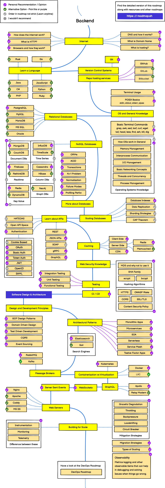

# Tentang Backend

## Daftar Isi

- [Daftar Isi](#daftar-isi)
- [Definisi](#definisi)
  - [Backend](#backend)
  - [Backend Engineer/Developer](#backend-engineerdeveloper)
    - [Backend Engineer](#backend-engineer)
    - [Backend Developer](#backend-developer)
    - [Poin Penting Terkait Backend Engineer dan Backend Developer](#poin-penting-terkait-backend-engineering-dan-backend-developer)
- [Jenis Aplikasi](#jenis-aplikasi)
  - [Fullstack](#fullstack)
  - [Frontend vs Backend](#frontend-vs-backend)
    - [Frontend](#frontend)
- [Jobdesc](#jobdesc)
- [Roadmap](#roadmap)
- [Karir](#karir)
  - [Peluang Karir](#peluang-karir)
  - [Admin RPL](#admin-rpl)
    - [Alumni](#alumni)
    - [Admin Aktif](#admin-aktif)

## Definisi

### Backend

> Backend merupakan bagian dari aplikasi yang bertanggung jawab untuk menyediakan kebutuhan yang tak terlihat oleh user (pengguna) seperti bagaimana suatu data itu disimpan, diolah, serta ditransaksikan secara aman.

Simplenya, _Backend_ merujuk pada bagian dari suatu perangkat lunak yang bertanggung jawab untuk **pemrosesan data**, **logika bisnis** aplikasi, dan **penyimpanan informasi**. Ini merupakan bagian yang bekerja di latar belakang aplikasi, memiliki sifat _invisible_ dan bertanggung jawab untuk mendukung fungsionalitas secara keseluruhan

Pentingnya _Backend_ tidak hanya terletak pada pengolahan data, melainkan juga pada koordinasi tugas-tugas kompleks di belakang layar yang membuat aplikasi berjalan dengan lancar. Tim **Backend Engineers** bertanggung jawab untuk merancang, mengembangkan dan memelihara infrastruktur server, sistem database, dan logika bisnis yang menjadi tulang punggu keseluruhan aplikasi. Dengan kemampuan mereka dalam menggunakan berbagai bahasa pemrograman dan teknologi backend, para `Engineers` diwajibkan untuk mecniptakan solusi yang efisien dan handal, menjadikan aplikasi siap beroperasi secara optimal. Sehingga nantinya aplikasi dapat berjalan dengan baik dan sesuai dengan kebutuhan yang telah ditetapkan.

### Backend Engineer/Developer

Sebelumnya pada penjelasan [Backend](#backend) sudah disinggung mengenai **Backend Engineering**. Berikut merupakan detail dari masing-masing istilah tersebut

#### Backend Engineer

_Backend Engineer_ adalah seseorang yang bertugas untuk merancang, membangun, dan memelihara sebuah aplikasi atau website dari sisi server. Dengan kata lain, tanggung jawab utama seorang `backend engineer` adalah membangun struktur aplikasi perangkan lunak.

Salah satu fungsi utama seorang _backend engineering_ dalam tim pengembangan perangkat lunak adalah menulis logika bisnis aplikasi, skrip server, dan API yang nantinya akan digunakan lebih lanjut oleh pengembang dan anggota tim lainnya.

_Backend Engineer_ juga bertanggung jawab untuk mengelola dan menyimpan data, baik itu dalam basis data atau sistem penyimpanan lainnya. Mereka harus memastikan bahwa aplikasi dapat berinteraksi dengan basis data dengan efisien, serta mengelola ketersediaan dan keamanan data.

Selain itu, backend engineers juga sering kali terlibat dalam optimasi kinerja aplikasi. Mereka harus memastikan bahwa server dapat menangani beban kerja yang tinggi dan memberikan respons dengan cepat. Pemahaman yang baik tentang skala, pemrosesan data, dan manajemen sumber daya server menjadi keterampilan yang sangat diperlukan.

#### Backend Developer

Seorang **Backend Developer** adalah profesional pengembangan perangkat lunak yang secara khusus fokus pada pengembangan sisi server suatu aplikasi atau website. Tugas utamanya melibatkan penulisan kode dan implementasi logika bisnis di sisi server untuk memastikan operasional keseluruhan aplikasi berjalan dengan lancar. Mereka memiliki tanggung jawab dalam pengelolaan logika bisnis, manajemen basis data, dan pembangunan API (_Application Programming Interface_) yang memungkinkan interaksi antar-komponen aplikasi.

Selain itu, `Backend Developer` juga terlibat dalam aspek keamanan, memastikan perlindungan terhadap potensi ancaman dan kerentanan. Kemampuan untuk mengoptimalkan kinerja server, bekerja sama dengan tim pengembangan frontend, dan melakukan `pemeliharaan rutin` serta perbaruan menjadi bagian integral dari peran ini. Biasanya seorang Backend Developer memiliki skill dalam bahasa pemrograman seperti Java, Python, atau Node.js, mereka menciptakan dasar yang kokoh untuk pengalaman pengguna yang responsif dan andal di bagian depan aplikasi. **Keberhasilan aplikasi atau website** seringkali tergantung pada kemampuan Backend Developer dalam menyediakan infrastruktur yang efisien dan aman.

Jika melihat dari gambar sebelumnya, ada beberapa langkah yang harus dilakukan oleh seorang backend developer, mulai dari diskusi dengan `client` hingga `launching` aplikasi.

#### Poin Penting terkait Backend Engineering dan Backend Developer

**Backend Engineering**

- Pengembangan dan Rekayasa
  Backend Engineer tidak hanya terfokus pada pengembangan kode tetapi terlibat dalam rekayasa perangkat lunak secara keseluruhan. Ini mencakup seperi `desain sistem`, `arsitektur`, dan _problem solving_ tingkat tinggi
- Skala dan Kinerja
  Backend Engineer memiliki tanggung jawab tambahan terkait dengan skalabilitas dan kinerja sistem. Mereka harus memastikan bahwa backend dapat menangani jumlah pengguna yang besar dan beroperasi secara efisien.
- Optimasi dan Keamanan
  Backend Engineer lebih sering terlibat dalam mengoptimalkan kinerja sistem dan menjaga keamanan aplikasi. Mereka dapat terlibat dalam pengoptimalan `query database`, `caching`, dan `strategi keamanan`.
- Kolaborasi Tim
  Backend Engineer dapat bekerja lebih erat dengan tim arsitek perangkat lunak dan tim lainnya untuk memastikan bahwa seluruh infrastruktur dan arsitektur sistem berjalan dengan baik.

**Backend Developer**

- Fokus Pekerjaan
  Backend Developer lebih fokus pada pengembangan perangkat lunak dan kode untuk bagian belakang (backend) suatu aplikasi. Tugas utama mencakup `merancang`, `mengembangkan`, dan `memelihara server`, `database`, dan `komponen lain` yang bertanggung jawab untuk pemrosesan data dan logika bisnis.

- Bahasa Pemrograman
  Backend Developer biasanya memiliki keahlian dalam bahasa pemrograman yang umum digunakan di sisi server, seperti Python, Java, Ruby, PHP, atau Node.js.

- Database dan Infrastruktur
  Memahami dan bekerja dengan database adalah bagian penting dari pekerjaan Backend Developer. Mereka berinteraksi dengan database untuk menyimpan dan mengambil data.

- Logika Bisnis
  Memiliki pemahaman tentang infrastruktur server dan konsep-konsep seperti API (Application Programming Interface) juga diperlukan.

## Jenis Aplikasi

### Fullstack

Istilah **fullstack** merujuk pada seseorang yang memiliki keterampilan dan pengetahuan untuk bekerja pada kedua sisi pengembangan perangkat lunak, yaitu frontend dan backend. Seorang fullstack developer memiliki keahlian dalam merancang, mengembangkan, dan memelihara bagian depan (frontend) dan belakang (backend) dari suatu aplikasi atau situs web. Dengan demikian, mereka mampu berkontribusi pada seluruh siklus pengembangan perangkat lunak.

#### Karakteristik Fullstack Developer

- Frontend Development
  Memiliki pemahaman yang baik tentang HTML, CSS, dan JavaScript. Memiliki kemampuan merancang dan mengembangkan antarmuka pengguna (UI) yang responsif dan menarik
- Backend Development
  Memiliki pemahaman yang baik tentang `Bahasa Pemrograman` _server-side_ seperti Python, Ruby, PHP, Node.js, Golang, dan sejenisnya dan yang paling penting memiliki pengalaman dalam bekerja dengan `database` dan memahami logika bisnis aplikasi
- Database Management
  Memiliki pemahaman yang baik tentang cara `berinteraksi` dengan datbaase, termasuk desain skema, pengoptimalan query, dan manajemen data.
- Server Management
  Memiliki kemampuan untuk menangani server dan infrastruktur, termasuk konfigurasi server dan manajemen deployment.
- Version Control
  Memiliki pemahaman tentang _version control system_ seperti git, github, dan sebagainya.
- Kemampuan Komunikasi
  Memiliki kemampuan berkomunikasi dengan baik dengan anggora tim, termasuk _designer_, _frontend dev_, dan lainnya.
- SDLC
  Memiliki pemahaman menyeluruh mengenai **Software Development Life Cycle** dari perencanaan hingga pengujian dan pemeliharaan.

Kelebihan seorang fullstack developer adalah kemampuannya untuk bekerja pada berbagai aspek pengembangan perangkat lunak, yang dapat menjadi aset berharga pada proyek-proyek yang lebih kecil atau tim pengembangan yang lebih kecil. Namun, pada proyek yang lebih besar, mungkin diperlukan spesialisasi yang lebih dalam di bidang frontend atau backend.

### Frontend vs Backend

#### Frontend

Istilah `frontend` mengacu pada antarmuka pengguna grafis (GUI) yang dapat berinteraksi langsung dengan pengguna, seperti menu navigasi, elemen desain, tombol, gambar, dan grafik. Secara teknis, halaman atau layar yang dilihat pengguna Anda dengan beberapa komponen UI disebut model objek dokumen (DOM).

Tiga bahasa pemrogrmaan utama memengaruhi cara pengguna berinteraksi dengan frontend:

- HTML mengatur struktur frontend dan elemen DOM yang berbeda
- Cascading Style Sheets (CSS) mengatur gaya aplikasi web, termasuk tata letak, font, warna, dan gaya visual
- JavaScript menambahkan lapisan fungsi dinamis dengan memanipulasi DOM

JavaScript dapat memicu perubahan pada halaman dan menampilkan informasi baru. Artinya, frontend dapat menangani interaksi (atau permintaan) pengguna mendasar, seperti menampilkan kalender atau memeriksa apakah pengguna telah memasukkan alamat email yang valid. Frontend meneruskan permintaan yang lebih kompleks ke backend.

| Kriteria                  | Frontend                                                                                                                                                                                                                              | Backend                                                                                                                                                                                                                                                |
| :------------------------ | :------------------------------------------------------------------------------------------------------------------------------------------------------------------------------------------------------------------------------------ | :----------------------------------------------------------------------------------------------------------------------------------------------------------------------------------------------------------------------------------------------------- |
| Teknologi                 | _Frontend_ menggunakan kerangka kerja HTML, CSS, JavaScript, dan frontend.                                                                                                                                                            | _Backend_ menggunakan bahasa pemrograman, seperti Java, Python, Ruby, API, dan sistem manajemen basis data.                                                                                                                                            |
| Konkurensi                | Setiap pengguna memiliki salinan aplikasi mereka sendiri sehingga _frontend_ tidak harus menangani masalah konkurensi                                                                                                                 | _Backend_ menggunakan beberapa strategi untuk menangani ribuan permintaan pengguna secara bersamaan                                                                                                                                                    |
| Caching                   | _Frontend_ menyimpan _file cache_ dari aplikasi dan menggunakannya untuk meningkatkan performa                                                                                                                                        | Sistem _backend_ melakukan _cache file_ di server yang berbeda atau di CDN (_content delivery network_)                                                                                                                                                |
| Keamanan                  | Sebagian besar keamanan dalam pengembangan _frontend_ merupakan tanggung jawab pengguna. Developer _frontend_ memiliki fokus utama pada validasi input pengguna dan alur kerja `autentikasi` pengguna                                 | Keamanan dalam pengembangan _backend_ lebih komprehensif untuk melindungi basis data (_Database_), layanan _backend_, dan aplikasi itu sendiri. Hal ini dicapai dengan menggunakan enkripsi, sistem autentikasi aman, dan praktik pengodean yang aman. |
| Tujuan Pengembangan       | Pengembangan _frontend_ berfokus pada pembuatan antarmuka (_interface_) pengguna yang berfungsi penuh, responsif, dan dirancang dengan baik                                                                                           | Pengembangan _backend_ melibatkan pembuatan arsitektur yang andal yang mendukun pengembangan _frontend_                                                                                                                                                |
| Keterampilan Pengembangan | Developer _frontend_ paham tentang HTML, CSS, dan JavaScript. Mereka dapat menggunakan kerangka kerja _frontend_ dan membuat halaman yang menarik secara visual. Mereka mengunkap masalah pengguna saat berinteraksi dengan aplikasi. | Developer _backend_ memiliki keterampilan pengodean dan manajemen basis data. Mereka juga memahami keamanan kode dan cara menggunakan alat, platform, dan kerangka kerja (_framework_) pengembangan aplikasi.                                          |

## Jobdesc

Apa aja sih jobdesc Backend Developer? Berat-berat ga? Dilansir dari [Workable](https://resources.workable.com/back-end-developer-job-description), ada 9 jodbesc dari Backend Developer:

1. Berperan aktif dalam siklus hidup aplikasi, dengan fokus pada pengkodean dan debugging
2. Menulis clean code untuk mengembangkan aplikasi web yang fungsional dan stabil
3. Mengidentifikasi dan memperbaiki masalah yang muncul dalam aplikasi
4. Melakukan tes User Interface (UI) untuk mengoptimalkan kinerja aplikasi
5. Bekerja sama dengan Frontend Developer (kelas sebelah) untuk mengintegrasikan elemen yang dihadapkan kepada user dengan logika server-side
6. Mengumpulkan dan menangani persyaratan teknis dan desain, serta memberikan pelatihan dan dukungan kepada tim internal
7. Membangun kode dan library untuk penggunaan aplikasi di semester depan
8. Bekerja sama dengan pengembang lain, desainer, dan administrator sistem untuk mengidentifikasi fitur baru
9. Mengikuti perkembangan teknologi terbaru

Jadi, berat engganya jobdesc Backend Developer tergantung temen-temen juga sih. Asal punya tekad dan rasa tanggung jawab yang besar, pasti temen-temen bisa melewatinya dengan baik. Semangattt

## Roadmap

Untuk menjadi seorang Backend Developer, ada beberapa hal utama yang harus teman-teman pelajari dan kuasai:

- Bahasa Pemrograman Backend (Golang, Python, PHP, dll)
- Database dan SQL
- Pengembangan Server dan API
- Konsep Keamanan Web
- Version Control (Git)
- Deployment dan DevOps

Kalau kalian ingin explore lebih lanjut tentang apa yang perlu dipelajari, roadmap berikut mungkin bisa membantu kalian😀👉

Emang harus semua dipelajari ya? AHAHAHAH engga dong, roadmap di atas hanyalah panduan bukan persyaratan mutlak untuk menjadi seorang Backend Developer. Kalau semuanya beneran harus dipelajari, ya tipes rek😩

Karena setiap proyek pengembangan web pasti memerlukan tech stack yang berbeda-beda sesuai dengan kebutuhan, sehingga hanya beberapa item roadmap yang diperlukan. Tetapi bukankah lebih baik kalau kita mempelajari dan menguasai suatu hal terlebih dahulu sebelum terjun ke lapangan? (ini tips biar banyak proyekan kayak cakno🤑)

## Karir

Setelah mengetahui roadmap Backend Developer, pasti teman-teman berpikir kalau ternyata buanyak banget yang harus dipelajari dan dikuasai. Ya ga sih? (sok tau bgt😇)

Emangnya kita bakal jadi apa sih? Kok banyak banget yang harus dikuasai?

### Peluang Karir

Jadi ada 3 tahapan karir untuk seorang Backend Developer menurut [springboard.com](https://www.springboard.com/blog/software-engineering/become-backend-developer/) :

1. Entry-Level Backend Developer
2. Mid-Level Backend Developer
3. Senior Backend Developer

#### Entry-Level Backend Developer

Di tingkat awal, Backend Developer biasanya fokus pada pemahaman dasar kode, teknologi stack, dan pengembangan fitur sederhana. Biasanya mereka terlibat dalam membuat dan menguji kode untuk fitur baru, memperbaiki bug, mengikuti code review, dan berkolaborasi dengan tim frontend

#### Mid-Level Backend Developer

Pada tingkat menengah, mereka mengambil tugas yang lebih kompleks dan sering bekerja secara mandiri atau bahkan memimpin sebuah proyek kecil. Tanggung jawab mereka meliputi desain dan implementasi fitur backend yang lebih robust, optimasi kode untuk performa yang lebih baik, dan berpartisipasi dalam desain arsitektur sistem baru

#### Senior / Lead Backend Developer

Di level senior, Backend Developer bertanggung jawab atas strategi pengembangan backend secara keseluruhan, membuat keputusan desain dan arsitektur tingkat tinggi, dan memimpin proyek yang kompleks. Mereka juga berperan sebagai mentor untuk anggota tim junior

Selain itu, ada berbagai spesialisasi yang bisa diikuti oleh Backend Developer, seperti:

- API Developer = Spesialis dalam pembuatan dan pemeliharaan API
- Database Developer = Ahli dalam desain, implementasi, dan manajemen sistem database
- Cloud Computing Developer = Fokud pada pembangunan dan pengelolaan aplikasi yang berjalan pada infrastruktur cloud
- DevOps Engineer = Menggabungkan pengembangan dengan sistem operasi untuk memperlancar lifecycle software development
- Security Engineer = Fokus pada perlindungan aplikasi web dan data dari ancaman
- System Architect = Bertanggung jawab atas desain struktur keseluruhan sistem backend

Nah terus gimana sih karir yang udah ditempuh para admin backend di lab RPL ini?

### Admin RPL Angkatan 2019

- Pramudya Tiandana Wisnu Gautama (**Wisnu**)

  

  - Lead Software Engineer di MyITSPuspresnas (2023 - Sekarang)
  - Backend Developer Intern di Blibli.com (2022)

- Fairuz Hasna Rofifah (**Hasna**)

  

  - Software Engineer di Samsung R&D Institute Indonesia (2023 - Sekarang)
  - Backend Engineer Intern di Telkom Indonesia (2022)

Beberapa dari kalian mungkin ngga asing denger nama mas-mbaknya. Kedua mas-mbak diatas merupakan alumni admin backend lab RPL angkatan 2019 yang udah lulus dan sedang menempuh karirnya masing-masing.

Eits, tunggu bentar. Para admin backend lab RPL yang masih aktif ngga kalah jago loh. Ada siapa aja tuh?

### Admin RPL Angkatan 2020 - 2021 (Aktif)

Jadi admin backend di lab RPL ini yang masih aktif ada :

- Alexander (**Alex**)

  

  - Senior Backend Developer di PPDB Jatim 2024 (2024 - Sekarang)
  - Backend Engineer Intern di Tokopedia (2023)

- Made Rianja Richo Dainino (**Richo**)

  

  - Lead Backend Developer Intern di Filinmovie (2023)
  - Quality Assurance di PPDB Jatim 2023 (2023)

- M. Naufal Badrutammam (**Cakno**)

  

  - Mid-level Backend Developer di PPDB Jatim 2024 (2024 - Sekarang)
  - Lead Backend Engineer di SRE ITS 2024 (2023 - Sekarang)

- Kevin Nathanael Halim (**Kevin**)

  

  - Mid-Level Backend Developer di PPDB Jatim 2024 (2024 - Sekarang)
  - Mid-Level Backend Developer Intern di Alpha Academy (2024 - Sekarang)

- Rizky Alifiyah Rahma (**Iky**)

  

  - Mid-Level Backend Developer Intern di MyITS Archive (2023 - Sekarang)
  - Backend Developer TD-GCS di Bayucaraka ITS (2023 - Sekarang)
