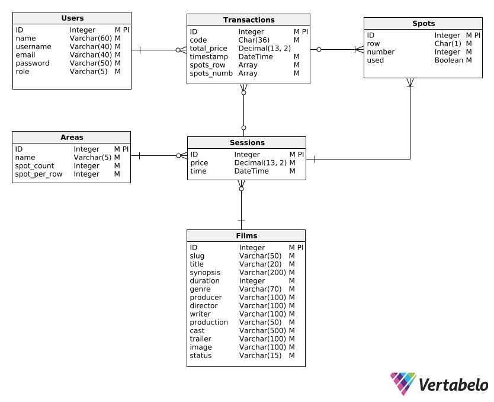
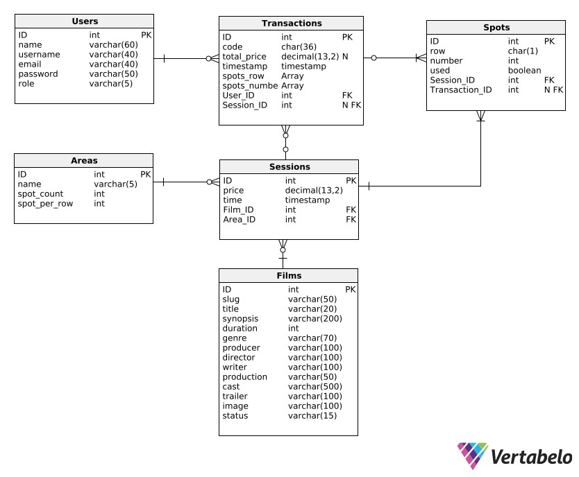
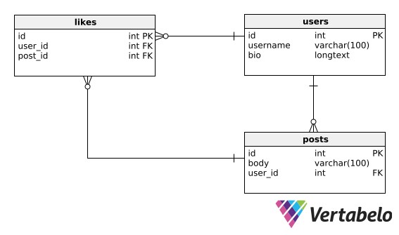
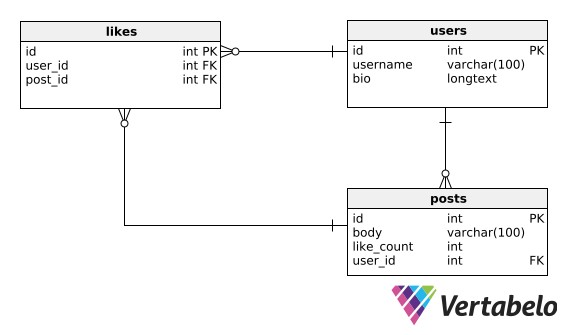

# Database

## Daftar Isi

- [Daftar Isi](#daftar-isi)
- [Definisi & Fungsi](#definisi--fungsi)
  - [Definisi](#definisi)
  - [Fungsi](#fungsi)
- [Jenis & Contoh](#jenis--contoh)
  - [Relational](#relational)
  - [Non-Relational](#non-relational)
- [Data Model](#data-model)
  - [CDM](#cdm)
  - [PDM](#pdm)
- [Query](#query)
- [Transaction](#transaction)
  - [Tujuan Transaction](#tujuan-transaction)
  - [Bagian-bagian Transaction](#bagian-bagian-transaction)
- [Optimalisasi & Normalisasi](#optimalisasi--normalisasi)
  - [Normalisasi](#normalisasi)
  - [Instagram Justin Bieber Problem](#instagram-justin-bieber-problem)
  - [N+1 Problem](#n1-problem)
- [Pemilihan](#pemilihan)

## Definisi & Fungsi

Mungkin kalian sudah sangat tidak asing dengan kata database atau basis data, terutama untuk kalian yang sudah pernah mengambil mata kuliah Sistem Basis Data (SBD) atau Manajemen Basis Data (MBD). Di modul ini, kita akan membahas terkait Database untuk merefresh memori kalian dan sekaligus berbagai pengetahuan terkait database yang diperlukan oleh seorang Backend Developer / Engineer.

### Definisi

Menurut Thomas Connolly and Carolyn Begg, database atau basis data adalah sebuah kumpulan data yang secara logis terkait dan dirancang untuk memenuhi suatu kebutuhan informasi dari sebuah organisasi. Sementara itu, Indrajati mendefinisikan database sebagai kumpulan data yang saling berhubungan secara logis dan didesain untuk mendapatkan data yang dibutuhkan oleh suatu organisasi.

Untuk menggunakan serta mengakses data-data di dalam database dengan mudah melalui komputer kita, biasanya kita menggunakan sesuatu yang bernama Sistem Manajemen Database (DBMS).

### Fungsi

Seperti yang sudah dibahas pada bagian definisi, database atau basis data berfungsi untuk menyimpan koleksi data dalam berbagai macam jenis dan bentuk secara elektronik, baik data dalam bentuk angka, teks/kata, waktu, gambar, video, file, dan lain-lain. Data-data yang disimpan nantinya dapat diakses dan juga dapat dimodifikasi dengan penambahan (INSERT), perubahan (UPDATE), dan penghapusan (DELETE).

Database sendiri memiliki berbagai macam penggunaan, mulai dari sekedar menyimpan data penting, penyimpanan data dari aplikasi yang juga terintegrasi secara langsung ke aplikasi tersebut, dan untuk memenuhi berbagai kebutuhan organisasi, perusahaan, kelompok, maupun individu dalam bidang apapun. Hal ini dikarenakan di zaman yang serba modern dan didominasi oleh teknologi ini, database khususnya yang memilki performa serta efisiensi tinggi sangatlah diperlukan untuk mengakomodasi berbagai kebutuhan sistem mulai dari toko online, bioskop, perpustakaan, akademis, dan berbagai macam kebutuhan lainnya.

## Jenis & Contoh

### Relational

### Non-Relational

## Data Model

Data Model adalah sebuah bentuk representasi visual dari struktur suatu sistem database dalam bentuk diagram yang dapat menjadi informasi maupun acuan untuk kebutuhan bisnis maupun pembangunan sistem. Biasanya pemodelan data atau pembuatan data model akan dilakukan sebelum penyusunan struktur sistem database agar dapat mempermudah proses dan ke depannya lebih jelas serta terstruktur. Data Model sendiri terbagi menjadi beberapa jenis yang salah duanya adalah CDM dan PDM.

Tujuan dari pembuatan data model adalah sebagai berikut,

- Membuat suatu representasi visual yang sederhana dari sistem yang kompleks untuk dijadikan bahan atau acuan penjelasan sistem maupun pengambilan keputusan terkait sistem
- Mempermudah, memperjelas, serta mengurangi tingkat kesalahan dalam proses desain dan implementasi dari struktur sistem database yang diperlukan
- Menjadi bentuk dokumentasi dari struktur sistem database yang jelas, berkualitas, dan mudah dipahami termasuk oleh orang-orang non-technical seperti client atau anggota tim non-technical

### CDM

CDM atau Conceptual Data Model merupakan bentuk data model yang paling high-level dan umumnya merupakan yang pertama kali dibuat sebelum dipetakan ke jenis data model yang lain. Data Model dengan tingkat kompleksitas yang rendah ini berfungsi untuk memberikan gambaran besar atau konsep terkait struktur dari sistem data yang akan dibangun dan tidak terlalu teknis sehingga cocok untuk dipresentasikan pada client atau orang-orang non-technical.

Isi dari CDM kurang lebih adalah jenis-jenis data, hubungan yang ada antar tiap data, dan juga aturan bisnis dari sistem yang dibangun. Berikut adalah contoh dari CDM untuk database Relational yang dibangun menggunakan perangkat lunak Vertabelo,



### PDM

PDM atau Physical Data Model merupakan bentuk data model hasil pemetaan dari CDM ke dalam suatu sistem database yang fungsional. Data model ini memiliki tingkat kompleksitas yang lebih tinggi dibandingkan CDM karena harus bisa merepresentasikan keseluruhan struktur dari sistem database berdasarkan DBMS yang digunakan.

Isi dari PDM kurang lebih sama dengan CDM, tetapi dengan penambahan beberapa atribut maupun entitas yang tidak ada pada CDM namun diperlukan untuk menjadi suatu database komplit seperti Foreign Key ataupun entitas hasil relasi. Dapat juga terjadi pergantian jenis data untuk menyesuaikan dengan skema atau sistem dari DBMS yang dipilih. Berikut adalah contoh dari PDM untuk database Relational yang juga dibangun menggunakan perangkat lunak Vertabelo,



## Query

## Transaction

Transaksi yang dimaksud disini bukanlah entitas transaksi yang digunakan dalam beberapa sistem database yang memerlukan adanya transaksi di dalamnya, melainkan salah satu subset atau unit dari SQL yakni Database Transaction atau Transaksi dalam Database.

Misalkan dalam suatu sistem pembelian tiket bioskop, seseorang membeli 4 kursi sekaligus yakni A1, A2, A3, dan A4 untuk 4 nama orang berbeda. Maka di dalam aplikasi akan dilakukan 4x query untuk membooking masing-masing kursi satu persatu berdasarkan nama orang yang dimasukkan untuk setiap kursi. Tetapi kemudian setelah query terhadap kursi A1 dan A2 berhasil, query untuk melakukan booking terhadap kursi A3 gagal karena suatu hal yang tak diketahui sehingga proses dihentikan dan aplikasi mengembalikan status error. Dalam kasus ini, kursi A1 dan A2 sudah terlanjur dalam kondisi terbooking pada database.

Nah, kira-kira bagaimana ya cara menangani permasalahan di atas? Database Transaction lah jawabannya!

### Tujuan Transaction

Tujuan dari Database Transaction adalah untuk menjaga properti ACID dari database, yakni Atomicity (selesai total / tidak sama sekali agar tidak menganggu), Consistency (database harus tetap konsisten setelah suatu transaksi berjalan tak peduli berhasil atau tidaknya), Isolation (setiap transaksi harus berjalan dalam kondisi database yang isolated/terpisahkan dari yang asli), Durability (ketika suatu transaksi selesai, efeknya harus tersimpan di database apapun yang terjadi sehingga bila terjadi crash maka data akan disesuaikan setelah database kembali berfungsi).

Mudahnya, kegunaan dari Transaction pada Database kurang mirip dengan kegunaan blok try dan catch pada programming yang digabungkan dengan sistem VCS (Version Control System) seperti Git, yakni digunakan untuk proses error handling, tetapi dalam hal ini secara spesifik untuk menangani error pada sekelompok query yang dilakukan ke database. Bila terjadi suatu kegagalan entah karena faktor internal (kesalahan di aplikasi) maupun eksternal (jaringan, browser, dan lain-lain) di salah satu dalam sekelompok query yang harus dijalankan, maka query secara keseluruhan akan dibatalkan.

### Bagian-bagian Transaction

Database Transaction terdiri dari 3 hal berikut,

1. START / BEGIN : Digunakan untuk memulai transaksi database sebelum dilakukannya query-query yang diinginkan

2. COMMIT : Bila semua proses / query yang dijalankan dalam transaksi berhasil, maka fungsi COMMIT dilakukan agar semua perubahan yang telah dilakukan tersimpan di database

3. ROLLBACK : Bila terdapat kegagalan pada salah satu saja proses / query yang dilakukan, maka semua proses akan dibatalkan dan tidak disimpan ke database.

## Optimalisasi & Normalisasi

Mungkin kalian pernah mendengar beberapa permasalahan terkait aplikasi lambat atau bahkan sering mengalami down (tewas). Salah satu kemungkinan yang paling sering menyebabkan hal ini ialah adanya sistem database yang kurang optimal sehingga mengharuskan sistem melakukan pekerjaan yang berat untuk beberapa atau bahkan semua query.

Untuk melakukan optimasi database dapat dilakukan dari 2 sisi, yakni dari sisi struktur database yang tentunya harus dipastikan optimal ketika pertama kali dibuat yang dapat dilakukan melalui Normalisasi dan juga dari sisi query yang harus menggunakan query seoptimal mungkin agar tidak memberatkan sisi server aplikasi. Contoh dari permasalahan database yang kurang optimal salah duanya adalah Justin Bieber Problem pada Instagram dan N+1 Problem, keduanya akan dibahas di bawah.

### Normalisasi

Untuk memastikan bahwa suatu struktur sistem database sudah optimal, efisien, tidak redundan, dan bebas dari anomali data, diperlukan suatu aksi yang bernama Normalisasi. Dalam normalisasi ada beberapa level yang disebut Normal Forms (NF), dengan masing-masing level memiliki kriteria tersendiri. Pembagian level yang ada terdiri dari,

- First Normal Form (1NF) : Merupakan level paling sederhana dari normalisasi. Pada level ini, setiap sel tabel hanya boleh memiliki 1 nilai saja dan setiap kolom harus mempunyai nama yang unik. Tujuannya untuk mengeliminasi data duplikat dan mempersimpel query.

  Contoh : https://www.javatpoint.com/dbms-first-normal-form

- Second Normal Form (2NF) : Level dimana syarat 1NF harus terpenuhi dan setiap kolom harus berkaitan secara langsung ke Primary Key dan bukan kolom lain untuk mengeliminasi data redundan.

  Contoh : https://www.javatpoint.com/dbms-second-normal-form

- Third Normal Form (3NF) : Level dimana syarat 2NF harus terpenuhi dan setiap atribut non-key bersifat independen dan hanya berhubungan secara langsung ke primary key dan bukan yang lain.

  Contoh : https://www.javatpoint.com/dbms-third-normal-form

- Boyce-Codd Normal Form (BCNF / 3.5NF) : Level yang merupakan bentuk lebih ketat dari 3NF dengan memastikan bahwa setiap atribut bukan key hanya bergantung ke key kandidat.

  Contoh : https://www.javatpoint.com/dbms-boyce-codd-normal-form

- Fourth Normal Form (4NF) : Level yang merupakan bentuk peningkatan dari BCNF yang memastikan tidak ada tabel yang memiliki lebih dari 1 data independen bernilai banyak yang mendeskripsikan suatu entitas (multi-valued dependency).

  Contoh : https://www.javatpoint.com/dbms-forth-normal-form

- Fifth Normal Form (5NF) : Level tertinggi dari normalisasi untuk saat ini karena untuk 6NF masih dalam tahap riset. Dilakukan penguraian terhadap tabel menjadi lebih kecil hingga tidak memungkinkan lagi (sampai ke tahap dimana bila diuraikan lagi akan menyebabkan kehilangan data) untuk menghindari redundansi dan meningkatkan integritas.

  Contoh : https://www.javatpoint.com/dbms-fifth-normal-form

### Instagram Justin Bieber Problem

Justin Bieber Problem merupakan permasalahan yang dialami Instagram beberapa tahun lalu, dimana ketika Justin Bieber kala itu melakukan upload terhadap suatu post, para fansnya yang bernama "Beliebers" dengan jumlahnya yang besar akan melakukan like secara massal dan menyebabkan sistem Instagram mengalami down.

Terjadinya down pada sistem Instragram ini ternyata bukan akibat query penambahan likenya, tetapi akibat dari query untuk menampilkan jumlah like terkini pada post milik Justin Bieber tersebut yang tentunya diakses oleh banyak orang pula.

Hal ini dapat diakibatkan oleh struktur database yang salah dan kurang optimal. Ibaratkan terdapat sebuah struktur database yang digambarkan melalui data model berikut,



Maka, untuk mendapatkan jumlah keseluruhan like dari suatu post, harus dilakukan query yang cukup berat yakni `SELECT COUNT(id) FROM likes WHERE likes.posts_id = x` yang bekerja dengan menghitung jumlah baris dari likes dari suatu post dengan id tertentu. Query ini mungkin akan ringan apabila jumlah like belum terlalu banyak, tetapi pada aplikasi dengan skala sebesar Instagram tentunya akan sangat fatal bila harus melakukan ini untuk seluruh pengguna yang membuka suatu postingan.

Tetapi ternyata untuk mengatasi permasalahan tersebut, dapat dilakukan hanya sesimpel dengan penambahan satu atribut saja pada tabel `posts` yakni `like_count` sehingga data model menjadi sebagai berikut,



Nantinya, untuk setiap aksi like dari seorang user terhadap suatu post, maka `like_count` dari entitas `posts` yang bersangkutan akan ditambah 1. Hal ini memang akan memperberat setiap aksi pemberian like karena ada operasi tambahan yang harus dilakukan, tetapi resource yang dibutuhkan untuk menangani penambahan operasi tersebut tidak sebanding dengan resource yang diperlukan untuk menangani query penghitungan like sebelumnya.

### N+1 Problem

N+1 Problem merupakan permasalahan yang cukup umum dan kali ini merupakan permasalahan akibat dari penggunaan query yang kurang optimal. Dinamakan N+1 karena rangkaian query yang dilakukan terdiri dari 1 query terhadap seluruh baris dari entitas tertentu pada database, kemudian melakukan 1 query lagi untuk setiap baris terkait (N baris) sehingga menjadi N+1.

Misalkan terdapat sebuah sistem perpustakaan dimana terdapat entitas `books` dan `authors` yang digambarkan melalui data model berikut,


Bila ingin mendapatkan seluruh buku dengan authornya, cara yang tidak optimal sehingga menyebabkan N+1 Problem adalah sebagai berikut,

```php
$books = Book::all();

foreach ($books as $book) {
  echo $book->author->name;
}
```

Potongan kode yang menggunakan Laravel Eloquent tersebut bila ditampilkan dalam bentuk query SQL maka menjadi sebagai berikut,

1. `SELECT * FROM books` untuk mendapatkan seluruh buku yang tersedia pada database
2. Loop N kali, `SELECT * FROM authors WHERE authors.id = x`, dimana x adalah id buku yang terkait.

Semakin banyak query yang dilakukan ke database akan memperberat kerja server sehingga usahakan untuk melakukan segala hal dengan jumlah query seminimal mungkin. Terdapat cara untuk menyelesaikan permasalahan tersebut dengan hanya 2 query saja yakni sebagai berikut,

```php
$books = Book::with('author')->get();
```

Dalam Laravel Eloquent, aksi tersebut disebut dengan Eager Loading yang mana bila digambarkan dalam query SQL sebagai berikut,

1. `SELECT * FROM books` untuk mendapatkan seluruh buku yang tersedia pada database
2. `SELECT * FROM authors WHERE id IN (a, b, c, d, e, f, g, h)` dimana a - h merupakan id dari setiap barisan buku yang diperoleh di query 1

Tentu dari jumlah perbedaan antara 2 query dengan N+1 query langsung bisa diketahui mana yang lebih baik dan tidak menyiksa server, terlebih bila nilai N sudah sangat banyak bahkan melebihi 1 juta baris data.

## Pemilihan

Setelah mempelajari cukup banyak terkait database, mungkin kalian bingung bagaimana cara menentukan database apa yang harus digunakan. Untuk memilih database yang paling sesuai, hal paling pertama yang harus disiapkan tentunya perlu dimiliki pemahaman menyeluruh terkait sistem yang akan dibangun dan kebutuhannya. Sebagai contoh, cobalah jawab pertanyaan-pertanyaan berikut,

1. Jenis data apa saja yang akan disimpan?
2. Seberapa kompleks struktur serta relasi dari data yang akan disimpan?
3. Bagaimana frekuensi Read dan Writenya?
4. Seberapa besar, banyak data maksimal yang mungkin disimpan?
5. Apakah ada batasan seperti budget atau lainnya?
6. Bagaimana skalabilitas aplikasi yang diperlukan?

Untuk menjawab pertanyaan-pertanyaan di atas, bis dimulai dengan mencoba membuat data model untuk memperkirakan kompleksitas serta struktur dari database yang paling sesuai untuk sistem. Misalkan struktur yang terbentuk sangat structured dan memiliki relasi kompleks maka Database Relasional (SQL) akan lebih cocok, tetapi apabila struktur yang terbentuk lebh ke arah semi-structured atau bahkan tidak structured dan memerlukan penyimpanan fleksibel mungkin Database Non-Relasional (NoSQL) dapat lebih sesuai.

Skalabilitas serta performa aplikasi juga penting untuk diperhatikan karena database NoSQL biasanya lebih mudah untuk dilakukan scaling dibandingkan database SQL. Kemudian, faktor kesesuaian dengan tech stack yang digunakan juga bisa berpengaruh, misalkan dalam penggunaan bahasa, framework, atau ORM tertentu bisa juga diperhatikan database apa saja yang kira-kira didukung.

Usahakan untuk menentukan database yang paling sesuai dengan sistem sebelum memulai pengembangan. Karena migrasi database terlebih lagi yang sudah banyak isi datanya ke database baru yang sangat berbeda itu berat, kamu ngga akan kuat.
