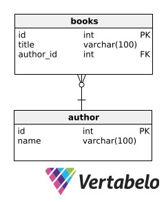

# Database

## Daftar Isi

- [Daftar Isi](#daftar-isi)
- [Definisi & Fungsi](#definisi--fungsi)
  - [Definisi](#definisi)
  - [Fungsi](#fungsi)
- [Jenis & Contoh](#jenis--contoh)
  - [Relational](#relational)
    - [Kelebihan Relational Database](#kelebihan-relational-database)
    - [Contoh Relational Database](#contoh-relational-database)
  - [Non-Relational](#non-relational)
    - [Kelebihan Non-Relational Database](#kelebihan-non-relational-database)
    - [Contoh Non-Relational Database](#contoh-non-relational-database)
  - [Relational Database vs Non-Relational Database](#relational-database-vs-non-relational-database)
- [Data Model](#data-model)
  - [CDM](#cdm)
  - [PDM](#pdm)
- [Query](#query)
- [Transaction](#transaction)
  - [Tujuan Transaction](#tujuan-transaction)
  - [Bagian-bagian Transaction](#bagian-bagian-transaction)
  - [Contoh Penggunaan Transaction](#contoh-penggunaan-transaction)
- [Optimalisasi & Normalisasi](#optimalisasi--normalisasi)
  - [Normalisasi](#normalisasi)
  - [Instagram Justin Bieber Problem](#instagram-justin-bieber-problem)
  - [N+1 Problem](#n1-problem)
- [Pemilihan](#pemilihan)
- [Implementasi](#implementasi)

## Definisi & Fungsi

Mungkin kalian sudah sangat tidak asing dengan kata database atau basis data, terutama untuk kalian yang sudah pernah mengambil mata kuliah Sistem Basis Data (SBD) atau Manajemen Basis Data (MBD). Di modul ini, kita akan membahas terkait Database untuk merefresh memori kalian dan sekaligus berbagai pengetahuan terkait database yang diperlukan oleh seorang Backend Developer / Engineer.

### Definisi

Menurut Thomas Connolly and Carolyn Begg, database atau basis data adalah sebuah kumpulan data yang secara logis terkait dan dirancang untuk memenuhi suatu kebutuhan informasi dari sebuah organisasi. Sementara itu, Indrajati mendefinisikan database sebagai kumpulan data yang saling berhubungan secara logis dan didesain untuk mendapatkan data yang dibutuhkan oleh suatu organisasi.

Untuk menggunakan serta mengakses data-data di dalam database dengan mudah melalui komputer kita, biasanya kita menggunakan sesuatu yang bernama Sistem Manajemen Database (DBMS).

### Fungsi

Seperti yang sudah dibahas pada bagian definisi, database atau basis data berfungsi untuk menyimpan koleksi data dalam berbagai macam jenis dan bentuk secara elektronik, baik data dalam bentuk angka, teks/kata, waktu, gambar, video, file, dan lain-lain. Data-data yang disimpan nantinya dapat diakses dan juga dapat dimodifikasi dengan penambahan (INSERT), perubahan (UPDATE), dan penghapusan (DELETE).

Database sendiri memiliki berbagai macam penggunaan, mulai dari sekedar menyimpan data penting, penyimpanan data dari aplikasi yang juga terintegrasi secara langsung ke aplikasi tersebut, dan untuk memenuhi berbagai kebutuhan organisasi, perusahaan, kelompok, maupun individu dalam bidang apapun. Hal ini dikarenakan di zaman yang serba modern dan didominasi oleh teknologi ini, database khususnya yang memilki performa serta efisiensi tinggi sangatlah diperlukan untuk mengakomodasi berbagai kebutuhan sistem mulai dari toko online, bioskop, perpustakaan, akademis, dan berbagai macam kebutuhan lainnya.

## Jenis & Contoh

### Relational


> Kumpulan item data yang hubungannya sudah ditentukan. Data disimpan dalam baris dan kolom serta secara kolektif membentuk tabel yang memiliki relasi satu sama lain.

_Relational_ database adalah kelompok _item_ dalam data degnan hubungan yang sudah ditentukan sebelumnya. Umumnya, _item_ ini disusun menjadi tabel yang terdiri dari kolom dan baris. Tabel sendiri dipakai untuk menyimpan informasi objek yang direpresentasikan dalam database.

Kolom dalam tabel memuat data tertentu dan nilai atribut. Baris pada tabel menunjukkan kesimpulan nilai dari suatu objek. Tiap baris pada tabel dapat ditandai secara unik atau dalam bentuk ID. Kerap disebut dengan kunci utama (_primary key_)

_Relational database_ adlaah penyajian **data** yangdigunakan untuk membuat `kesimpulan` dan `analisis`. Data ini dapat diakses langsung tanpa harus menyusun ulang menjadi tabel baru dalam database.

#### Kelebihan Relational Database

Dilansir dari [Educba](https://educba.com/relational-database-advantages/), kelebihan ini membuat `database relational` tetap digunakan dan terus dikembangkan dari waktu ke waktu.

Berikut adalah beberapa diantaranya:
Kriteria | Kelebihan
:------ |:-----
Sederhana | _Database_ ini cukup sederhana dan tidak membutuhkan `hierarki data` yang sangat kompleks untuk membuatnya. Bahkan, data yang ada bisa dengan mudah ditangani oleh SQL _query_
Mudah diakses | Tidak ada aturan khusus yang dibuat untuk bisa mengakses semua `data` yang sudah dibuat dalam bentuk tabel. Dalam _relational database_ siapapun bisa mengakses dengan mudah dan cepat
Akurasi data tinggi | Saat menggunakan _relational database_, kita akan menggunakan kunci utama (_foreign key_) dan kunci asing (_foreign key_). Hadirnya dua kunci untuk melakukan seleksi ini membuat dua data yang berhubungan satu sama lain tidak mengalami duplikasi. Karena dalam _relational database_ apapun yang sama akan ditampilkan sekali saja. Jadi, `akurasi` datanya menjadi lebih tinggi.
Fleksibilitas | _Relational database_ cenderung lebih fleksibel dalam banyak hal khususya berhubungan dengan penambahan data. Apabila ada `tambahan data` yang jumlahnya besar, semua bisa ditampung dan diolah tanpa membebani. Artinya pemegang _database_ bisa dengan mudah melakukan modifikasi pada data baik menambah, mengurangi, atau mengganti.

#### Contoh Relational Database

Tidak semua _database_ memiliki fungsi _relational_ lohh. Berikut adalah beberapa contoh `Realtional Database`

- MySQL
  Salah satu aplikasi _relational database open source_ terbaik yang ada saat ini. Selain itu aplikasi ini juga beberapa lisensi tambahan yang bisa diambil sesuai dengan kebutuhan. `MySQL` memberikan kemudahan saat input data dan memiliki performa tinggi.

- MariaDB
  Aplikasi ini sebenarnya dibuat dengan base MySQL dengan beberapa penambahan. MariaDB menambahkan ruangan untuk _engine_ dan mengatasi adanya limitasi. Dengan kemampuan ini database menjadi lebih cepat.Salah satu hasil dari _relational database_ yang dibuat dengan MariaDB adalah Google, Mozilla, hingga Wikimedia.

- PostgreSQL
  Hampir sama dengan MariaDB, aplikasi ini juga merupakan pengembangan meski masih dalam naungan open source. Kelebihan dari database ini adalah performa dan fleksibilitas yang meningkat saat menangani database. `PostgreSQL` juga bisa melakukan pembacaan data yang cepat untuk melakukan analisis. Produk dari database ini adalah Skype dan Instagram.

### Non-Relational

Basis data `non0relasional` (sering disebut basis data **NoSQL**) berbeda dari basis data relasional tradisional karena basis data tersebut menyimpan datanya dalam bentuk non-tabular. Sebaliknya, database ini mungkin didasarkan pada struktur data seperti dokumen, JSON, dan format lainnya. Sebuah `dokumen` yang sangat rinci sekaligus berisi berbagai jenis informasi berbeda dalam format berbeda. `Kemampuan` untuk mencerna dan mengatur berbagai jenis informasi secara berdampingan membuat database non-relasional ini jauh lebih fleksibel dibandingkan database relasional.


_Contoh Dokumen Pasien di Pelayanan Kesehatan._

Basis data `non-relasional` sering digunakan ketika sejumlah besar data yang kompleks dan beragam perlu diatur. Misalnya, sebuah toko besar mungkin memiliki _database_ di mana setiap pelanggan memiliki dokumennya sendiri yang berisi semua informasi mereka, mulai dari nama dan alamat hingga riwayat pesanan dan informasi kartu kredit. Meskipun formatnya berbeda, masing-masing informasi ini dapat disimpan dalam dokumen yang sama.

**Basis data** non-relasional sering kali bekerja lebih cepat karena kueri tidak harus melihat beberapa tabel untuk memberikan jawaban, seperti yang sering dilakukan oleh kumpulan `data relasional`. Oleh karena itu, database non-relasional `ideal` untuk menyimpan data yang sering diubah atau untuk aplikasi yang menangani berbagai jenis data. Mereka dapat mendukung aplikasi yang `berkembang pesat` yang memerlukan database dinamis yang dapat berubah dengan cepat dan mengakomodasi sejumlah besar data yang kompleks dan tidak terstruktur.

#### Kelebihan Non-Relational Database

| Kriteria                               | Kelebihan                                                                                                                                                                                                                                                                                                                                                                                                                                              |
| :------------------------------------- | :----------------------------------------------------------------------------------------------------------------------------------------------------------------------------------------------------------------------------------------------------------------------------------------------------------------------------------------------------------------------------------------------------------------------------------------------------- |
| Organisasi kumpulan data besar-besaran | Di era Big Data, database non-relasional tidak hanya dapat menyimpan informasi dalam jumlah besar, namun juga dapat melakukan query terhadap kumpulan data tersebut dengan mudah. Skala dan kecepatan merupakan keuntungan penting dari database non-relasional.                                                                                                                                                                                       |
| Perluasan basis data yang fleksibel    | Data tidak statis. Semakin banyak informasi yang dikumpulkan, database non-relasional dapat menyerap titik data baru ini, memperkaya database yang sudah ada dengan tingkat nilai granular baru meskipun database tersebut tidak sesuai dengan tipe data dari informasi yang sudah ada sebelumnya.                                                                                                                                                     |
| Beberapa struktur data                 | Data yang kini dikumpulkan dari pengguna memiliki berbagai bentuk, mulai dari angka dan string, hingga konten foto dan video, hingga riwayat pesan. Basis data memerlukan kemampuan untuk menyimpan berbagai format informasi ini, memahami hubungan di antara format tersebut, dan melakukan kueri terperinci. Apa pun format informasi Anda, database non-relasional dapat menyusun tipe informasi berbeda secara bersamaan dalam dokumen yang sama. |
| Dibangun untuk cloud                   | Basis data non-relasional bisa berukuran sangat besar. Dan karena mereka bisa, dalam beberapa kasus, tumbuh secara eksponensial, mereka memerlukan lingkungan hosting yang bisa tumbuh dan berkembang bersama mereka. Skalabilitas yang melekat pada cloud menjadikannya rumah ideal untuk database non-relasional.                                                                                                                                    |

#### Contoh Non-Relational Database

- MongoDB
- Apache Cassandra
- Apache CocuhDB
- Neo4j
- DinamoDB

Selengkapnya, teman-teman bisa cek pada url berikut [Beberapa Jenis Database Non-Relational](https://www.griyasis.com/10-jenis-database-nosql-terpopuler-2022)

### Relational Database vs Non-Relational Database

| Kategori        | Relational Database                                                | Non-Relational Database                                    |
| :-------------- | :----------------------------------------------------------------- | :--------------------------------------------------------- |
| Data Model      | Berbentuk tabel                                                    | Berbentuk dokumen, _key-value_, atau grafik                |
| Jenis data      | Terstruktur                                                        | Data terstruktur, semistruktur, hingga tidak terstruktur   |
| Integritas data | Tinggi dengan kepatuhan **ACID** penuh                             | Model konsistensi akhir                                    |
| Performa        | Ditingkatkan dengan menambahkan lebih banyak sumber daya ke server | Ditingkatkan dengan menambahkan lebih banyak simpul server |
| Penskalaan      | Pensklaan horizontal membutuhkan strategi manajemen data tambahan  | Penskalaan horizontal sangatlah mudah.                     |

## Data Model

Data Model adalah sebuah bentuk representasi visual dari struktur suatu sistem database dalam bentuk diagram yang dapat menjadi informasi maupun acuan untuk kebutuhan bisnis maupun pembangunan sistem. Biasanya pemodelan data atau pembuatan data model akan dilakukan sebelum penyusunan struktur sistem database agar dapat mempermudah proses dan ke depannya lebih jelas serta terstruktur. Data Model sendiri terbagi menjadi beberapa jenis yang salah duanya adalah CDM dan PDM.

Tujuan dari pembuatan data model adalah sebagai berikut,

- Membuat suatu representasi visual yang sederhana dari sistem yang kompleks untuk dijadikan bahan atau acuan penjelasan sistem maupun pengambilan keputusan terkait sistem
- Mempermudah, memperjelas, serta mengurangi tingkat kesalahan dalam proses desain dan implementasi dari struktur sistem database yang diperlukan
- Menjadi bentuk dokumentasi dari struktur sistem database yang jelas, berkualitas, dan mudah dipahami termasuk oleh orang-orang non-technical seperti client atau anggota tim non-technical

### CDM

CDM atau Conceptual Data Model merupakan bentuk data model yang paling high-level dan umumnya merupakan yang pertama kali dibuat sebelum dipetakan ke jenis data model yang lain. Data Model dengan tingkat kompleksitas yang rendah ini berfungsi untuk memberikan gambaran besar atau konsep terkait struktur dari sistem data yang akan dibangun dan tidak terlalu teknis sehingga cocok untuk dipresentasikan pada client atau orang-orang non-technical.

Isi dari CDM kurang lebih adalah jenis-jenis data, hubungan yang ada antar tiap data, dan juga aturan bisnis dari sistem yang dibangun. Berikut adalah contoh dari CDM untuk database Relational yang dibangun menggunakan perangkat lunak Vertabelo,


### PDM

PDM atau Physical Data Model merupakan bentuk data model hasil pemetaan dari CDM ke dalam suatu sistem database yang fungsional. Data model ini memiliki tingkat kompleksitas yang lebih tinggi dibandingkan CDM karena harus bisa merepresentasikan keseluruhan struktur dari sistem database berdasarkan DBMS yang digunakan.

Isi dari PDM kurang lebih sama dengan CDM, tetapi dengan penambahan beberapa atribut maupun entitas yang tidak ada pada CDM namun diperlukan untuk menjadi suatu database komplit seperti Foreign Key ataupun entitas hasil relasi. Dapat juga terjadi pergantian jenis data untuk menyesuaikan dengan skema atau sistem dari DBMS yang dipilih. Berikut adalah contoh dari PDM untuk database Relational yang juga dibangun menggunakan perangkat lunak Vertabelo,


## Query

Query dalam konteks Database dapat diartikan sebagai capability (kemampuan) database pada komputer untuk menampilkan/menyimpan informasi tertentu. Namun perlu diketahui bahwa kemampuan tersebut hanya berupa pre-defined code artinya jika permintaan tidak sesuai dengan informasi yang tersimpan di database, maka permintaan tidak dapat diproses. Query ini biasanya ditulis dalam SQL (Structures Query Language), sebuah bahasa standar untuk berinteraksi dengan sistem manajemen database relasional

### Bagian-Bagian Query

Query Database terdiri dari 3 hal berikut:

#### DDL (Data Definition Language)

Query DDL digunakan untuk mendefinisikan dan mengubah struktur database beserta objeknya seperti tabel, index, dan view. Query ini menggunakan perintah:

- `CREATE` untuk membuat objek baru dalam database
- `ALTER` untuk memodifikasi struktur objek yang sudah ada
- `DROP` untuk menghapus objek dari database

#### DML (Data Manipulation Language)

Query DML digunakan untuk mengambil dan memanipulasi data yang sudah dibuat pada database. Query ini menggunakan perintah:

- `SELECT` untuk mengambil data dari satu tabel atau lebih
- `INSERT` untuk menambahkan data baru ke dalam tabel
- `UPDATE`untuk memodifikasi data yang sudah ada di dalam tabel
- `DELETE` untuk menghapus data dari tabel

#### DCL (Data Control Language)

QUery DCL digunakan untuk mengontrol akses ke data dalam database. Query ini menggunakan perintah:

- `GRANT` untuk memberikan hak akses untuk melakukan operasi tertentu pada objek database
- `REVOKE` untuk mencabut hak akses yang telah diberikan sebelumnya

### Contoh Query Sederhana

```sql
-- Contoh Perintah SELECT
SELECT [DISTINCT] select_list
FROM table_source
[WHERE search_condition]
[GROUP BY group_by_expression]
[HAVING search_condition]
[ORDER BY order_expression [ASC | DESC] ];

-- Contoh Perintah SELECT pada Tabel
CREATE TABLE table_name1 (
  column_1 datatype PRIMARY KEY,
  column_2 datatype,
  column_3 datatype,
  FOREIGN KEY (column_3) REFERENCES table_reference(id_reference)
);

-- Contoh Perintah ALTER TABLE
ALTER TABLE table_name1
ADD column_2 datatype;

-- Contoh Perintah GRANT
GRANT jenis_hak_akses ON nama_database.nama_tabel TO 'username'@'host';

-- Contoh Perintah REVOKE
REVOKE jenis_hak_akses ON nama_database.nama_tabel FROM 'username'@'host';
```

### Join

Join bisa dikatakan sebagai teknik untuk menggabungkan baris dari dua tabel atau lebih sehingga memungkinkan untuk menciptakan set data yang berasal dari beberapa tabel berdasarkan relasi antar tabel. Jenis join termasuk `INNER JOIN`, `LEFT JOIN`, `RIGHT JOIN`, `CROSS JOIN`, dan `SELF JOIN`.

1. `INNER JOIN` = Digunakan ketika ingin mengembalikan baris saat ada kecocokan di kedua tabel
2. `LEFT JOIN` = Digunakan ketika ingin mengambil semua baris dari tabel kiri dan baris yang cocok dari tabel kanan. Jika tidak ada kecocokan, maka hasilnya akan `NULL` pada sisi kanan.
3. `RIGHT JOIN` = Kebalikan dengan `LEFT JOIN`, `RIGHT JOIN` digunakan untuk mengambil semua baris dari tabel kanan dan baris yang cocok dari tabel kiri. Jika tidak ada kecocokan, maka hasilnya akan NULL pada sisi kiri.
4. `FULL JOIN` = Digunakan ketika ingin mengembalikan semua baris dari kedua tabel. Jika baris dari satu sisi yang tidak memiliki pasangan di sisi lainnya, maka akan menampilkan `NULL`.
5. `CROSS JOIN` = Join ini akan menghasilkan Cartesian product dari dua tabel, yaitu menggabungkan setiap baris dari tabel pertama dengan setiap baris dari tabel kedua. Biasanya digunakan pada kasus dimana perlu untuk menggabungkan setiap baris dari satu tabel dengan baris tabel lain.
6. `SELF JOIN` = Digunakan untuk membandingkan baris dalam tabel yang sama karena tabel tersebut di-JOIN-kan dengan dirinya sendiri

> Penggunaan `FULL JOIN` dan `CROSS JOIN` sekilas hampir sama, namun sebenarnya berbeda. `FULL JOIN` digunakan untuk menggabungkan semua baris dari dua tabel, menampilkan semua baris dari kedua sisi dengan nilai `NULL` untuk baris yang tidak cocok. Sedangkan `CROSS JOIN` digunakan untuk membuat kombinasi setiap baris dari dua tabel tanpa mempertimbangkan hubungan atau kecocokan antar baris.

### Subquery dan Nested Query

Subquery dan Nested Query digunakan untuk membuat query yang lebih kompleks dan dinamis

#### Subquery

Subquery adalah query yang disematkan di dalam query lain. Subquery biasanya ditulis di dalam tanda kurung dan dapat digunakan di berbagai tempat dalam query utama, termasuk di klausa `SELECT`, `FROM`, dan `WHERE`. Subquery sering digunakan untuk memfilter hasil query utama, sebagai sumber data untuk klausa `FROM`, dan menentukan nilai dalam klausa `SELECT` atau `WHERE`. Ada 3 jenis Subquery:

1. **Single-row subquery**: Mengembalikan satu baris dari hasil.
2. **Multiple-row subquery**: Mengembalikan beberapa baris.
3. **Correlated subquery**: Subquery yang referensinya bergantung pada data dari query utama.

#### Nested Query

Nested Query adalah bentuk khusus dari subquery dimana subquery akan digunakan di dalam subquery lain, sehingga memungkinkan penciptaan struktur query yang lebih kompleks dan bertingkat. Nested Query berguna dalam situasi analisis data kompleks yang mungkin perlu melakukan operasi berlapis. Berikut adalah contoh Nested Query:

- Nested QUery dalam klausa WHERE
  ```sql
  SELECT *
  FROM tabel1
  WHERE kolom1 IN (SELECT kolom1
                   FROM tabel2
                   WHERE kondisi);
  ```
- Nested QUery dalam klausa FROM
  ```sql
  SELECT *
  FROM (SELECT kolom1, kolom2
        FROM tabel1) AS sub_tabel
  WHERE kondisi;
  ```

> Meskipun subquery dan nested query meningkatkan kekuatan SQL, mereka juga bisa membuat query menjadi lebih sulit untuk dibaca dan dipahami

### Views

Views adalah representasi virtual dari tabel atau kombinasi tabel. Secara esensial, view adalah hasil dari query dan berperilaku seperti tabel. View tidak menyimpan data secara fisik, tetapi data tersebut diambil dari tabel-tabel yang query-nya mendasari view tersebut. Ada beberapa kegunaan ketika menggunakan Views:

1. Dapat membatasi akses pengguna ke data tertentu
2. Memudahkan query yang kompleks dan berulang, memungkinkan pengguna untuk bekerja dengan hasil query sebagai tabel biasa
3. Menyediakan lapisan abstraksi dari struktur data yang sebenarnya, memungkinkan pengguna untuk bekerja dengan data tanpa perlu mengetahui detail query yang kompleks

Berikut adalah sintaks dasar Views:

- Membuat View
  ```sql
  CREATE VIEW nama_view AS
  SELECT kolom1, kolom2, ...
  FROM tabel;
  ```
- Menggunakan View
  ```sql
  SELECT * FROM nama_view;
  ```
- Mengupdate View

  ```sql
  CREATE OR REPLACE VIEW nama_view AS
  SELECT kolom1, kolom2, ...
  FROM tabel;

  -- Akan tetapi tidak semua view dapat diupdate. Hal ini bergantung pada query yang mendasari view tersebut, seperti view yang dibuat dengan fungsi agregasi
  ```

- Menghapus View
  ```sql
  DROP VIEW IF EXISTS nama_view;
  ```

> Beri nama view dengan cara yang mendeskripsikan isinya agar mudah diidentifikasi.

### Indexes

Index dalam database SQL adalah struktur data yang meningkatkan kecepatan operasi pada tabel. Index memungkinkan sistem database untuk menemukan dan mengakses baris dalam tabel lebih cepat.

Index bekerja mirip dengan indeks dalam buku, memungkinkan database untuk mencari data tanpa harus membaca seluruh tabel. Index biasanya dibuat pada kolom yang sering digunakan untuk mencari, filter, atau join data.

#### Jenis-jenis Index

1. **Single-Column Index**: Index dibuat untuk satu kolom dalam tabel.
2. **Composite Index**: Index yang dibuat dari dua atau lebih kolom dalam tabel.
3. **Unique Index**: Memastikan bahwa dua baris tidak dapat memiliki nilai indeks yang sama.
4. **Clustered Index**: Menyusun baris fisik data dalam tabel berdasarkan kunci indeks.
5. **Non-Clustered Index**: Membuat struktur terpisah dari data pada tabel yang hanya berisi nilai kunci dan referensi ke data asli.

#### Contoh Penggunaan Index

- Membuat Index

  ```sql
  -- Single Index
  CREATE INDEX nama_index ON nama_tabel (kolom1);

  -- Composite Index
  CREATE INDEX nama_index ON nama_tabel (kolom1, kolom2);
  ```

- Menghapus Index
  ```sql
  DROP INDEX nama_index ON nama_tabel;
  ```

#### Kelebihan dan Kekurangan

- Kelebihan
  - Dapat meningkatkan kecepatan query secara signifikan
  - Mengurangi waktu yang dibutuhkan untuk menemukan data dalam tabel besar
- Kekurangan
  - Membutuhkan ruang penyimpanan tambahan
  - Operasi `INSERT`, `UPDATE`, dan `DELETE` bisa menjadi lebih lambat karena index juga perlu diperbarui
  - Tidak semua kolom cocok untuk diindeks sehingga perlu berhati-hati dalam membuat index

> Membuat terlalu banyak index dapat memperlambat operasi penulisan.

## Transaction

Transaksi yang dimaksud disini bukanlah entitas transaksi yang digunakan dalam beberapa sistem database yang memerlukan adanya transaksi di dalamnya, melainkan salah satu subset atau unit dari SQL yakni Database Transaction atau Transaksi dalam Database.

Misalkan dalam suatu sistem pembelian tiket bioskop, seseorang membeli 4 kursi sekaligus yakni A1, A2, A3, dan A4 untuk 4 nama orang berbeda. Maka di dalam aplikasi akan dilakukan 4x query untuk membooking masing-masing kursi satu persatu berdasarkan nama orang yang dimasukkan untuk setiap kursi. Tetapi kemudian setelah query terhadap kursi A1 dan A2 berhasil, query untuk melakukan booking terhadap kursi A3 gagal karena suatu hal yang tak diketahui sehingga proses dihentikan dan aplikasi mengembalikan status error. Dalam kasus ini, kursi A1 dan A2 sudah terlanjur dalam kondisi terbooking pada database.

Nah, kira-kira bagaimana ya cara menangani permasalahan di atas? Database Transaction lah jawabannya!

### Tujuan Transaction

Tujuan dari Database Transaction adalah untuk menjaga properti ACID dari database, yakni Atomicity (selesai total / tidak sama sekali agar tidak menganggu), Consistency (database harus tetap konsisten setelah suatu transaksi berjalan tak peduli berhasil atau tidaknya), Isolation (setiap transaksi harus berjalan dalam kondisi database yang isolated/terpisahkan dari yang asli), Durability (ketika suatu transaksi selesai, efeknya harus tersimpan di database apapun yang terjadi sehingga bila terjadi crash maka data akan disesuaikan setelah database kembali berfungsi).

Mudahnya, kegunaan dari Transaction pada Database kurang mirip dengan kegunaan blok try dan catch pada programming yang digabungkan dengan sistem VCS (Version Control System) seperti Git, yakni digunakan untuk proses error handling, tetapi dalam hal ini secara spesifik untuk menangani error pada sekelompok query yang dilakukan ke database. Bila terjadi suatu kegagalan entah karena faktor internal (kesalahan di aplikasi) maupun eksternal (jaringan, browser, dan lain-lain) di salah satu dalam sekelompok query yang harus dijalankan, maka query secara keseluruhan akan dibatalkan.

### Bagian-bagian Transaction

Database Transaction terdiri dari 3 hal berikut,

1. START / BEGIN : Digunakan untuk memulai transaksi database sebelum dilakukannya query-query yang diinginkan

2. COMMIT : Bila semua proses / query yang dijalankan dalam transaksi berhasil, maka fungsi COMMIT dilakukan agar semua perubahan yang telah dilakukan tersimpan di database

3. ROLLBACK : Bila terdapat kegagalan pada salah satu saja proses / query yang dilakukan, maka semua proses akan dibatalkan dan tidak disimpan ke database.

### Contoh Penggunaan Transaction

Contoh penerapan dari Database Transaction dalam SQL adalah sebagai berikut,

```sql
-- inisialisasi transaksi
START TRANSACTION;

-- ganti username dari pengguna 1 ke 'user1'
UPDATE users SET username = 'user1' WHERE id = 1;

-- ganti username dari pengguna 2 dan 3 ke 'userNew'
UPDATE users SET username = 'userNew' WHERE id IN (2, 3);

-- melakukan commit terhadap perubahan (atau rollback bila terjadi kegagalan)
COMMIT;
```

## Optimalisasi & Normalisasi

Mungkin kalian pernah mendengar beberapa permasalahan terkait aplikasi lambat atau bahkan sering mengalami down (tewas). Salah satu kemungkinan yang paling sering menyebabkan hal ini ialah adanya sistem database yang kurang optimal sehingga mengharuskan sistem melakukan pekerjaan yang berat untuk beberapa atau bahkan semua query.

Untuk melakukan optimasi database dapat dilakukan dari 2 sisi, yakni dari sisi struktur database yang tentunya harus dipastikan optimal ketika pertama kali dibuat yang dapat dilakukan melalui Normalisasi dan juga dari sisi query yang harus menggunakan query seoptimal mungkin agar tidak memberatkan sisi server aplikasi. Contoh dari permasalahan database yang kurang optimal salah duanya adalah Justin Bieber Problem pada Instagram dan N+1 Problem, keduanya akan dibahas di bawah.

### Normalisasi

Untuk memastikan bahwa suatu struktur sistem database sudah optimal, efisien, tidak redundan, dan bebas dari anomali data, diperlukan suatu aksi yang bernama Normalisasi. Dalam normalisasi ada beberapa level yang disebut Normal Forms (NF), dengan masing-masing level memiliki kriteria tersendiri. Pembagian level yang ada terdiri dari,

- First Normal Form (1NF) : Merupakan level paling sederhana dari normalisasi. Pada level ini, setiap sel tabel hanya boleh memiliki 1 nilai saja dan setiap kolom harus mempunyai nama yang unik. Tujuannya untuk mengeliminasi data duplikat dan mempersimpel query.

  Contoh : https://www.javatpoint.com/dbms-first-normal-form

- Second Normal Form (2NF) : Level dimana syarat 1NF harus terpenuhi dan setiap kolom harus berkaitan secara langsung ke Primary Key dan bukan kolom lain untuk mengeliminasi data redundan.

  Contoh : https://www.javatpoint.com/dbms-second-normal-form

- Third Normal Form (3NF) : Level dimana syarat 2NF harus terpenuhi dan setiap atribut non-key bersifat independen dan hanya berhubungan secara langsung ke primary key dan bukan yang lain.

  Contoh : https://www.javatpoint.com/dbms-third-normal-form

- Boyce-Codd Normal Form (BCNF / 3.5NF) : Level yang merupakan bentuk lebih ketat dari 3NF dengan memastikan bahwa setiap atribut bukan key hanya bergantung ke key kandidat.

  Contoh : https://www.javatpoint.com/dbms-boyce-codd-normal-form

- Fourth Normal Form (4NF) : Level yang merupakan bentuk peningkatan dari BCNF yang memastikan tidak ada tabel yang memiliki lebih dari 1 data independen bernilai banyak yang mendeskripsikan suatu entitas (multi-valued dependency).

  Contoh : https://www.javatpoint.com/dbms-forth-normal-form

- Fifth Normal Form (5NF) : Level tertinggi dari normalisasi untuk saat ini karena untuk 6NF masih dalam tahap riset. Dilakukan penguraian terhadap tabel menjadi lebih kecil hingga tidak memungkinkan lagi (sampai ke tahap dimana bila diuraikan lagi akan menyebabkan kehilangan data) untuk menghindari redundansi dan meningkatkan integritas.

  Contoh : https://www.javatpoint.com/dbms-fifth-normal-form

### Instagram Justin Bieber Problem

Justin Bieber Problem merupakan permasalahan yang dialami Instagram beberapa tahun lalu, dimana ketika Justin Bieber kala itu melakukan upload terhadap suatu post, para fansnya yang bernama "Beliebers" dengan jumlahnya yang besar akan melakukan like secara massal dan menyebabkan sistem Instagram mengalami down.

Terjadinya down pada sistem Instragram ini ternyata bukan akibat query penambahan likenya, tetapi akibat dari query untuk menampilkan jumlah like terkini pada post milik Justin Bieber tersebut yang tentunya diakses oleh banyak orang pula.

Hal ini dapat diakibatkan oleh struktur database yang salah dan kurang optimal. Ibaratkan terdapat sebuah struktur database yang digambarkan melalui data model berikut,


Maka, untuk mendapatkan jumlah keseluruhan like dari suatu post, harus dilakukan query yang cukup berat yakni `SELECT COUNT(id) FROM likes WHERE likes.posts_id = x` yang bekerja dengan menghitung jumlah baris dari likes dari suatu post dengan id tertentu. Query ini mungkin akan ringan apabila jumlah like belum terlalu banyak, tetapi pada aplikasi dengan skala sebesar Instagram tentunya akan sangat fatal bila harus melakukan ini untuk seluruh pengguna yang membuka suatu postingan.

Tetapi ternyata untuk mengatasi permasalahan tersebut, dapat dilakukan hanya sesimpel dengan penambahan satu atribut saja pada tabel `posts` yakni `like_count` sehingga data model menjadi sebagai berikut,


Nantinya, untuk setiap aksi like dari seorang user terhadap suatu post, maka `like_count` dari entitas `posts` yang bersangkutan akan ditambah 1. Hal ini memang akan memperberat setiap aksi pemberian like karena ada operasi tambahan yang harus dilakukan, tetapi resource yang dibutuhkan untuk menangani penambahan operasi tersebut tidak sebanding dengan resource yang diperlukan untuk menangani query penghitungan like sebelumnya.

### N+1 Problem

N+1 Problem merupakan permasalahan yang cukup umum dan kali ini merupakan permasalahan akibat dari penggunaan query yang kurang optimal. Dinamakan N+1 karena rangkaian query yang dilakukan terdiri dari 1 query terhadap seluruh baris dari entitas tertentu pada database, kemudian melakukan 1 query lagi untuk setiap baris terkait (N baris) sehingga menjadi N+1.

Misalkan terdapat sebuah sistem perpustakaan dimana terdapat entitas `books` dan `authors` yang digambarkan melalui data model berikut,



Bila ingin mendapatkan seluruh buku dengan authornya, cara yang tidak optimal sehingga menyebabkan N+1 Problem adalah sebagai berikut,

```php
$books = Book::all();

foreach ($books as $book) {
  echo $book->author->name;
}
```

Potongan kode yang menggunakan Laravel Eloquent tersebut bila ditampilkan dalam bentuk query SQL maka menjadi sebagai berikut,

1. `SELECT * FROM books` untuk mendapatkan seluruh buku yang tersedia pada database
2. Loop N kali, `SELECT * FROM authors WHERE authors.id = x`, dimana x adalah id buku yang terkait.

Semakin banyak query yang dilakukan ke database akan memperberat kerja server sehingga usahakan untuk melakukan segala hal dengan jumlah query seminimal mungkin. Terdapat cara untuk menyelesaikan permasalahan tersebut dengan hanya 2 query saja yakni sebagai berikut,

```php
$books = Book::with('author')->get();
```

Dalam Laravel Eloquent, aksi tersebut disebut dengan Eager Loading yang mana bila digambarkan dalam query SQL sebagai berikut,

1. `SELECT * FROM books` untuk mendapatkan seluruh buku yang tersedia pada database
2. `SELECT * FROM authors WHERE id IN (a, b, c, d, e, f, g, h)` dimana a - h merupakan id dari setiap barisan buku yang diperoleh di query 1

Tentu dari jumlah perbedaan antara 2 query dengan N+1 query langsung bisa diketahui mana yang lebih baik dan tidak menyiksa server, terlebih bila nilai N sudah sangat banyak bahkan melebihi 1 juta baris data.

## Pemilihan

Setelah mempelajari cukup banyak terkait database, mungkin kalian bingung bagaimana cara menentukan database apa yang harus digunakan. Untuk memilih database yang paling sesuai, hal paling pertama yang harus disiapkan tentunya perlu dimiliki pemahaman menyeluruh terkait sistem yang akan dibangun dan kebutuhannya. Sebagai contoh, cobalah jawab pertanyaan-pertanyaan berikut,

1. Jenis data apa saja yang akan disimpan?
2. Seberapa kompleks struktur serta relasi dari data yang akan disimpan?
3. Bagaimana frekuensi Read dan Writenya?
4. Seberapa besar, banyak data maksimal yang mungkin disimpan?
5. Apakah ada batasan seperti budget atau lainnya?
6. Bagaimana skalabilitas aplikasi yang diperlukan?

Untuk menjawab pertanyaan-pertanyaan di atas, bis dimulai dengan mencoba membuat data model untuk memperkirakan kompleksitas serta struktur dari database yang paling sesuai untuk sistem. Misalkan struktur yang terbentuk sangat structured dan memiliki relasi kompleks maka Database Relasional (SQL) akan lebih cocok, tetapi apabila struktur yang terbentuk lebh ke arah semi-structured atau bahkan tidak structured dan memerlukan penyimpanan fleksibel mungkin Database Non-Relasional (NoSQL) dapat lebih sesuai.

Skalabilitas serta performa aplikasi juga penting untuk diperhatikan karena database NoSQL biasanya lebih mudah untuk dilakukan scaling dibandingkan database SQL. Kemudian, faktor kesesuaian dengan tech stack yang digunakan juga bisa berpengaruh, misalkan dalam penggunaan bahasa, framework, atau ORM tertentu bisa juga diperhatikan database apa saja yang kira-kira didukung.

Usahakan untuk menentukan database yang paling sesuai dengan sistem sebelum memulai pengembangan. Karena migrasi database terlebih lagi yang sudah banyak isi datanya ke database baru yang sangat berbeda itu berat, kamu ngga akan kuat.

## Implementasi

Setelah mempelajari semua hal di atas terkait Database, kini saatnya kita mengaplikasikan database dalam pekerjaan kita. Bagaimana caranya? Tentunya bergantung pada tech stack serta database yang akan kita gunakan. Sebagai contoh, bila kita ingin menggunakan tech stack yakni Python dengan database MySQL, maka kita dapat mencari library berupa driver yang cocok untuk melakukan integrasi dengan database, dalam hal ini adalah MySQL Driver. Berikut adalah contoh implementasi dari <a href="">W3Schools</a> :

```py
mydb = mysql.connector.connect(
  host="localhost",
  user="yourusername",
  password="yourpassword",
  database="mydatabase"
)

mycursor = mydb.cursor()

mycursor.execute("CREATE TABLE customers (name VARCHAR(255), address VARCHAR(255))")
```

Sementara itu, misalkan kita memilih menggunakan tech stack yang sama tetapi dengan database yang berbeda, ambil contoh PostgreSQL, maka kita harus menggunakan PostgreSQL Driver yang sesuai dengan tech stack yang kita pilih. Berikut adalah contoh dari implementasi PostgreSQL pada Python dari <a href="">Datacamp</a> :

```py
conn = psycopg2.connect(
  database = "datacamp_courses",
  user = "datacamp",
  host= 'localhost',
  password = "postgresql_tutorial",
  port = 5432)

cur = conn.cursor()

cur.execute("""CREATE TABLE datacamp_courses(
            course_id SERIAL PRIMARY KEY,
            course_name VARCHAR (50) UNIQUE NOT NULL,
            course_instructor VARCHAR (100) NOT NULL,
            topic VARCHAR (20) NOT NULL);
            """)

conn.commit()

cur.close()
conn.close()
```

Walaupun kedua potongan kode di atas terlihat berbeda, pada dasarnya alur kerjanya tidak jauh berbeda. Mungkin bila diperhatikan, sebelum bisa bermain-main dengan query kedua potongan kode di atas selalu diawali dengan fungsi `connect()`. Sesuai dengan namanya, itu adalah fungsi yang menghubungkan program kita dengan server database yang konfigurasinya kita masukkan ke dalam fungsi sebagai parameter. Biasanya terdapat `host` dari server, `user` yang akan digunakan untuk membuat koneksi dengan database beserta `password`nya, kemudian juga `port` dari server yang biasanya pada PostgreSQL menggunakan 5432 sementara pada MySQL biasanya menggunakan 3306, dan juga `database` untuk memilih database spesifik.

Setelah koneksi terbentuk, barulah kita dapat berinteraksi dengan database sesuai dengan izin atau permission yang dimiliki oleh user yang kita gunakan. Interaksi tentunya dilakukan melalui query seperti yang sudah kita pelajari sebelumnya. Nah, sekarang saatnya kalian melakukan eksplorasi lebih dan mempraktekkan semua yang sudah dipelajari disini, selamat mencoba!
