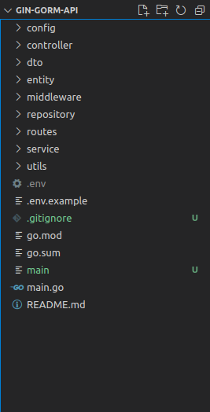
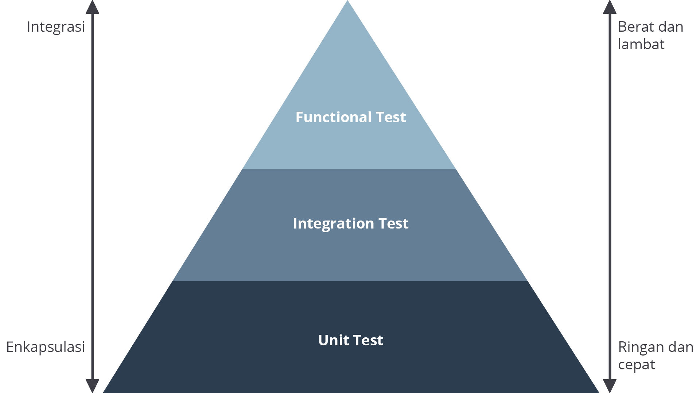
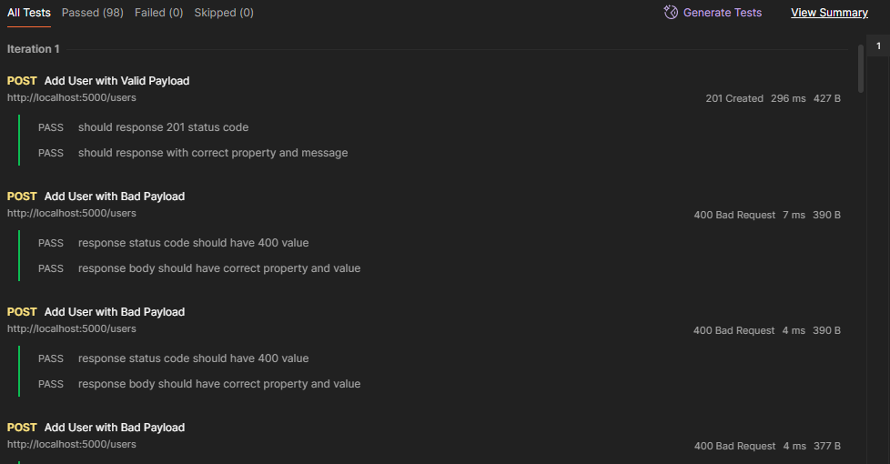
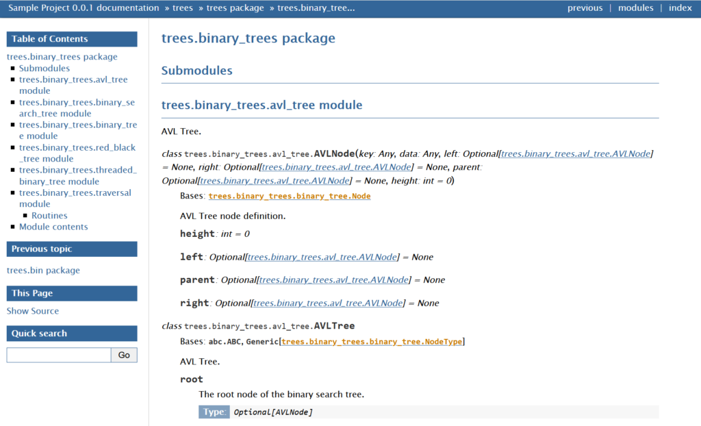
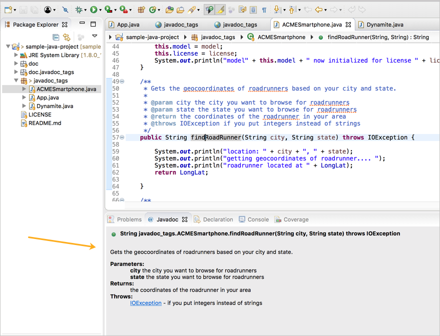
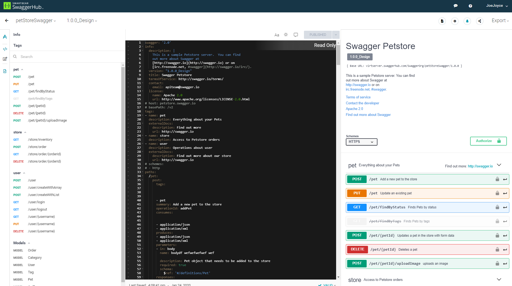

# Extras

## Daftar Isi

- [Daftar Isi](#daftar-isi)
- [Arsitektur Codebase](#arsitektur-codebase)
  - [Clean Architecture](#clean-architecture)
  - [Implementasi Clean Architecture](#implementasi-clean-architecture)
- [Automation Test](#automation-test)
  - [Unit Test](#unit-test)
  - [Integration / Feature Test](#integration--feature-test)
  - [Functional / Acceptance Test](#functional--acceptance-test)
  - [Contoh Implementasi](#contoh-implementasi)
- [Dokumentasi](#dokumentasi)
  - [Komentar Kode](#komentar-kode)
  - [Developer Guide](#developer-guide)
  - [Tools Dokumentasi](#tools-dokumentasi)
    - [Doxygen](#doxygen)
    - [Sphinx](#sphinx)
    - [Javadoc](#javadoc)
    - [Swagger (OpenAPI)](#swagger-openapi)
    - [Postman](#postman)
  - [Tutorial Postman](#tools-dokumentasi)

## Arsitektur Codebase
Sebelumnya kita telah membuat aplikasi Go yang lebih terstruktur. Struktur tersebut memisahkan beberapa implementasi sehingga kode yang ditulis lebih rapi. Sejatinya, tidak ada struktur / arsitektur yang secara resmi dinyatakan oleh para developer Golang. Anda bisa membuat sendiri struktur yang seperti apa yang nyaman untuk dipakai. Selain itu, ada beberapa referensi arsitektur yang mungkin tidak asing di telinga kita seperti *Onion Architecture*, *Model-View-Controller (MCV)*, *Clean Architecture*, *Event-Driven Architecture* dan lain-lain. Pada modul kali ini kita akan membahas terkait *Clean Architecture*. 

### Clean Architecture


**Clean Architecture** adalah sebuah arstektur sistem yang digagas oleh *Robert C. Martin (Uncle Bob)*. Clean Architecture memisahkan elemen-elemen desain ke dalam kelompok sehingga memenuhi prinsip-prinsip perangkat lunak yang baik, seperti berikut

- Independen terhadap framework perangkat lunak yang dibuat tidak terikat terhadap keadaan library ataupun framework, sehingga membuat penggunaan framework lebih sebagai alat dibandingkan menggunakan framework untuk membangun seluruh aplikasi.
- Dapat melakukan testing Alur bisnis dapat diuji tanpa UI, database, web server, ataupun elemen external lainnya. 
- Independen terhadap UI, UI dapat berubah sewaktu-waktu dan perangkat lunak (utamanya di alur bisnis) tidak perlu ikut diubah.
- Independen terhadap database, Database yang digunakan dapat ditukar (SQL menjadi MongoDB dan alur bisnis tidak terikat ke database).
- Independen terhadap elemen eksternal apa pun, Alur bisnis seharusnya tidak tahu tentang dunia luar.

#### Implementasi Clean Architecture
Kita akan mencoba mengimplementasikan **Clean Architecture** yang umum dipakai pada bahasa pemrograman ``Golang``. Pada arsitektur ini, aplikasi akan dibagi menjadi beberapa bagian sesuai dengan struktur folder aplikasi.

<p align="center">
  
</p>

Penjelasan tiap-tiap folder :
- **config**
Folder ini digunakan untuk kode terkait konfigurasi, contohna seperti konfigurasi database, SMTP Email, dan sebagainya.
- **controller**
Folder ini digunakan untuk kode terkait controller, controller adalah bagian dari program yang berfungsi menerima request dan memberikan response kepada *client*.
- **dto**
Folder ini digunakan untuk kode terkait dto, dto atau data transfer object adalah placeholder atau wadah suatu objek yang digunakan untuk menampung data request dan response
- **entity**
Folder ini digunakan untuk kode terkait entitas/model pada program.
- **middleware**
Folder ini digunakan untuk kode terkait middleware. Middleware adalah perangkat lunak yang menengahi suatu operasi. Maksudnya disini adalah middleware bertindak sebagai perantara antara berbagai komponen perangkat lunak, seperti server, aplikasi,i yang memungkinkan mereka berkomunikasi dan berinteraksi secara efisien. Fungsi middleware ini biasanya meliputi pengelolaan permintaan HTTP, otentikasi pengguna, pengolahan pesan, dan masih banyak lagi. Dengan adanya folder khusus untuk middleware dalam proyek perangkat lunak, para pengembang dapat dengan mudah mengatur dan mengelola middleware yang diperlukan untuk aplikasi mereka. Ini membantu meningkatkan skalabilitas, keamanan, dan kinerja aplikasi dengan lebih baik. Middleware juga dapat membantu dalam implementasi logika bisnis, pemantauan error, dan penanganan perubahan data.
- **repository**
Folder ini digunakan untuk kode terkait repository. Repository adalah lapisan yang berhubungan langsung dengan database.
- **routes**
Folder ini digunakan untuk kode terkait routing.
- **service**
Folder ini digunakan untuk kode terkait service. Service adalah lapisan yang berhubungan dengan logika/alur bisnis aplikasi.
- **utils**
Folder ini digunakan untuk kode terkait utilitas lainnya, contohnya seperti kode untuk perhitungan yang akan digunakan di banyak package lainnya.

Alur aplikasi kita akan seperti ini :

<p align="center">
  
</p>

Dapat dilihat bahwa tiap lapisan menimbulkan keterkaitan (dependensi) pada lapisan lainnya di bawahnya. Hal ini dapat dilakukan dengan istilah *dependency injection*. Berikut adalah contoh dependency injection di golang yang terdapat pada repository, service, dan controller.

**Repository**
```go
type userRepository struct {
  db *gorm.DB
}

func NewUserRepository(db *gorm.DB) UserRepository {
  return &userRepository{
    db: db,
  }
}
```

**Service**
```go
type userService struct {
  userRepo repository.UserRepository
}

func NewUserService(ur repository.UserRepository) UserService {
  return &userService{
    userRepo: ur,
  }
}
```

**Controller**
```go
type userController struct {
  jwtService  service.JWTService
  userService service.UserService
}

func NewUserController(us service.UserService, jwt service.JWTService) UserController {
  return &userController{
    jwtService:  jwt,
    userService: us,
  }
}
```

Logikanya adalah **userService** memerlukan **userRepo**, maka saat membuat **userService**, kita akan memasukkan **userRepo** sebagai parameternya, **userRepo** juga dibuat sebagai entitas di dala userService. Berlaku juga untuk controller terhadap service. Untuk memahami lebih lengkapnya terkait *Clean Architecture*, kalian bisa melihat Repository yang ada di link berikut https://github.com/Lab-RPL-ITS/go-clean-architecture  

## Automation Test

Dalam proses pembangunan aplikasi, khususnya ketika penulisan kode, bagaimana cara memastikan bahwa kode yang baru kamu tulis berjalan dengan lancar tanpa merusak satupun fungsional dari kode lain yang sudah ada sebelumnya? Mungkin bila jumlah fitur dan use case yang tersedia masih sedikit, cara percobaan secara manual di local akan bekerja dengan baik. Tetapi bagaimana bila fitur dan use case yang tersedia sudah sangat banyak? Tentu testing terhadap keseluruhan aplikasi akan menjadi hal yang paling menghabiskan waktu dari penambahan suatu fitur atau perbaikan bug.

Untuk mencegah hal tersebut, maka kita harus memahami dan mengaplikasikan automation testing ke dalam keseluruhan fase pengembangan aplikasi kita. Automation Testing adalah pengujian secara otomatis yang dilakukan oleh komputer untuk menentukan apakah sesuatu yang dalam hal ini adalah program, sudah berjalan dengan baik sesuai harapan atau tidak dengan melakukan simulasi terhadap kode yang telah kita tulis.



Suatu kultur dalam pengembangan aplikasi yang mengaplikasikan automation test pada keseluruhan codebase disebut TDD (Test Driven Development). Sesuai dengan gambar di atas, Automation Test terdiri dari 3 jenis test yang akan dibahas pada bagian ini.

### Unit Test

Unit Test adalah testing yang fokusnya hanya pada 1 unit saja, sehingga tidak perlu memperhatikan hasil kolaborasi dengan kode lain karena ada bagiannya sendiri nanti. Pada test ini, kita cukup fokus secara spesifik pada 1 bagian sehingga bila terjadi kegagalan kita langsung mengetahui bahwa masalahnya ada pada bagian tersebut.

Berikut adalah contoh implementasi Unit Test pada API dengan tech stack Laravel (PHP) pada fitur sinkronisasi dari tabel `medical_test_statistics` yang menyimpan statistik berkaitan dengan isi dari entitas MedicalTest,

```php
class MedicalTestSyncTest extends SQLiteTestCase
{
  use MigrateAnalyticsDatabase;

  protected Collection $cities;

  protected Model $subdistrict;

  protected Collection $users;

  public function setUp(): void
  {
    parent::setUp();

    $this->subdistrict = Subdistrict::factory()->create();
    $this->users = User::factory(5)->create([
      'subdistrict_id' => $this->subdistrict->id,
    ]);
    $status = MedicalTest::getStatesFor('status')->toArray();

    $this->users->each(function ($user, $index) use ($status) {
      MedicalTest::factory()->create([
          'user_id' => $user->id,
          'status' => $status[$index % 3],
      ]);
    });
  }

  /* @test */
  public function test_medical_test_sync(): void
  {
    (new MedicalTestAnalyticService())->sync();
    $this->assertDatabaseHas('medical_test_statistics', [
      'city_id' => $this->subdistrict->city->id,
      'city_name' => $this->subdistrict->city->name,
      'total_students' => $this->users->count(),
      'total_unverified' => 2,
      'total_invalid' => 2,
      'total_valid' => 1,
    ]);
  }
}
```

Sebagai perbandingan, berikut adalah contoh Unit Test untuk fitur penambahan / registrasi pengguna pada API dengan tech stack HapiJS (JavaScript) menggunakan Jest,

```js
describe("AddUserUseCase", () => {
  it("should orchestrating the add user action correctly", async () => {
    // Arrange
    const useCasePayload = {
      username: "uname",
      password: "secret",
      fullname: "Full Name",
    };

    const expectedRegisteredUser = new RegisteredUser({
      id: "user-123",
      username: useCasePayload.username,
      fullname: useCasePayload.fullname,
    });

    const mockUserRepository = new UserRepository();
    const mockPasswordHash = new PasswordHash();

    mockUserRepository.verifyAvailableUsername = jest.fn(() => Promise.resolve());
    mockPasswordHash.hash = jest.fn(() => Promise.resolve("encrypted_password"));
    mockUserRepository.addUser = jest.fn(() =>
      Promise.resolve(
        new RegisteredUser({
          id: "user-123",
          username: useCasePayload.username,
          fullname: useCasePayload.fullname,
        })
      )
    );

    const getUserUseCase = new AddUserUseCase({
      userRepository: mockUserRepository,
      passwordHash: mockPasswordHash,
    });

    // Action
    const registeredUser = await getUserUseCase.execute(useCasePayload);

    // Assert
    expect(registeredUser).toStrictEqual(expectedRegisteredUser);
    expect(mockUserRepository.verifyAvailableUsername).toBeCalledWith(useCasePayload.username);
    expect(mockPasswordHash.hash).toBeCalledWith(useCasePayload.password);
    expect(mockUserRepository.addUser).toBeCalledWith(
      new UserRegister({
        username: useCasePayload.username,
        password: "encrypted_password",
        fullname: useCasePayload.fullname,
      })
    );
  });
});
```

### Integration / Feature Test

Integration / Feature Test adalah testing yang fokusnya terhadap suatu fitur lengkap yang merupakan bentuk atau hasil kolaborasi antar beberapa unit berbeda. Tujuannya untuk memastikan keharmonisan antara setiap unit yang menjadi satu set penyusun suatu fitur.

Berikut adalah contoh implementasi Integration / Feature Test pada API dengan tech stack Laravel (PHP), masih pada fitur sinkronisasi dari tabel `medical_test_statistics` yang menyimpan statistik berkaitan dengan isi dari entitas MedicalTest,

```php
class AnalyticMedicalTestTest extends BaseBackOfficeTestCase
{
    use MigrateAnalyticsDatabase;

    protected function getResourcePath(): string
    {
        return parent::getResourcePath().'/analytic/medical-tests';
    }

    public function setUp(): void
    {
        parent::setUp();

        $this->model = MedicalTestStatistic::factory()->create(); // @phpstan-ignore-line
    }

    /* @test */
    public function test_index_analytic_medical_tests(): void
    {
        $this->response = $this->withToken($this->token)->getJson($this->getEndpoint());
        $this->assertApiCollection($this->model->toArray());
    }
}
```

Sebagai perbandingan juga, berikut adalah contoh Integration / Feature Test untuk fitur penambahan / registrasi pengguna pada API dengan tech stack HapiJS (JavaScript) menggunakan Jest,

```js
describe("Users endpoints", () => {
  afterAll(async () => {
    await pool.end();
  });

  afterEach(async () => {
    await UsersTableTestHelper.cleanTable();
    await AuthenticationsTableTestHelper.cleanTable();
  });

  describe("when POST /authentications", () => {
    it("should respond with status code 201 and new authentication", async () => {
      // Arrange
      const requestPayload = {
        username: "uname",
        password: "secret",
      };
      const server = await createServer(container);
      await server.inject({
        method: "POST",
        url: "/users",
        payload: {
          username: "uname",
          password: "secret",
          fullname: "Full Name",
        },
      });

      // Action
      const response = await server.inject({
        method: "POST",
        url: "/authentications",
        payload: requestPayload,
      });

      // Assert
      const responseJson = JSON.parse(response.payload);
      expect(response.statusCode).toEqual(201);
      expect(responseJson.status).toEqual("success");
      expect(responseJson.data.accessToken).toBeDefined();
      expect(responseJson.data.refreshToken).toBeDefined();
    });
  });
});
```

### Functional / Acceptance Test

Functional / Acceptance Test atau yang biasa juga dikenal sebagai End-to-End Test (E2E Test) merupakan testing dengan tingkat tertinggi yang berfokus pada keseluruhan aplikasi, tujuannya memastikan aplikasi secara keseluruhan berjalan dengan baik. Biasanya dijalankan dalam bentuk simulasi pada platform yang sama dengan yang digunakan oleh pengguna nantinya.

Contohnya bila mengembangkan aplikasi web, maka Functional / Acceptance Test harus dijalankan pada browser. Jika Anda mengembangkan aplikasi Mobile, Functional / Acceptance Test harus dijalankan pada device Mobile Phone. Dalam pembuatan API sendiri, Functional / Acceptance Test dapat dijalankan menggunakan fitur testing dari Postman.



Apa tuh Postman? Nah, pas banget, akan kita bahas di materi berikutnya.

### Contoh Implementasi

Untuk lebih jelasnya terkait TDD (Test Driven Development), contoh penerapannya dalam sebuah codebase API yang menerapkan Clean Architecture dan dibangun dengan tech stack HapiJS (JavaScript) serta dilengkapi automation testing menggunakan Jest dapat dilihat <a href="https://github.com/zetsux/garuda-forum-api">disini</a>.

## Dokumentasi
Dokumentasi sangatlah penting untuk membantu menjelaskan kode kepada developer lain dan kepada user. Hal ini juga dapat memudahkan pemeliharaan dan pengembangan lebih lanjut dari sebuah proyek. Dokumentasi yang efektif mencakup berbagai aspek, mulai dari komentar kode hingga panduan penggunaan API. Berikut adalah beberapa cara dan best practice dalam pembuatan dokumentasi pemrograman:

### Komentar Kode
Komentar pada kode digunakan untuk menjelaskan tujuan, parameter, nilai return, dan perilaku dari fungsi atau metode yang dibuat. Dalam komentar ini bisa juga untuk menjelaskan logika dibalik blok kode yang kompleks agar lebih mudah dipahami. Berikut contohnya:
```go
// CalculateCircleArea menghitung luas lingkaran berdasarkan radius yang diberikan.
// Parameter: radius - radius dari lingkaran
// Returns: luas dari lingkaran
func CalculateCircleArea(radius float64) float64 {
    return math.Pi * radius * radius
}
```

### Developer Guide
Dalam Developer Guide atau Panduan Pengembang ini akan menjelaskan bagaimana mengatur lingkungan pengembangan, termasuk depedensi yang diperlukan, memberikan langkah-langkah instalasi hingga menjalankan proyek, dan memberikan cara bagaimana orang lain bisa berkontribusi apabila proyek yang dikembangkan adalah proyek open source. Untuk contoh dokumentasinya bisa dilihat di <a href="https://neo4j.com/developer/example-project/">Contoh Developer Guide</a>

### Tools Dokumentasi
Sesuai namanya, Tools Dokumentasi Kode membantu developer dalam membuat, mengelola, dan menyajikan dokumentasi untuk source code serta API. Dokumentasi ini penting untuk memahami dan menggunakan kode dengan efektif, terutama dalam proyek besar atau saat bekerja dalam tim. Ada beberapa tools yang biasa digunakan:

#### Doxygen
Doxygen adalah alat untuk menghasilkan dokumentasi dari kode sumber dengan menggunakan komentar khusus dan markup dalam kode. Doxygen dapat menghasilkan dokumentasi dalam format HTML, LaTeX, RTF, PDF, dan man pages. Ini juga dapat menghasilkan diagram kelas dan hubungan antar kode secara otomatis. Doxygen sangat cocok untuk proyek yang menggunakan bahasa pemrograman C, C++, C#, PHP, Java, Python atau bahasa yang didukung lainnya, terutama untuk proyek dengan basis kode besar yang membutuhkan visualisasi struktur kode. Dokumentasi Doxygen bisa dilihat di <a href="https://www.doxygen.nl/manual/starting.html">Dokumentasi Doxygen</a>


#### Sphinx
Sphinx awalnya dibuat untuk mendokumentasikan proyek Python, tetapi sekarang dapat digunakan untuk bahasa pemrograman lain dengan menggunakan ekstensi yang tersedia. Sphinx menggunakan reStructuredText sebagai markup bahasanya dan mendukung output dalam berbagai format seperti HTML, PDF, dan ePub. Sphinx juga mendukung autodoc, fitur yang secara otomatis mengimpor docstrings dari kode Python ke dalam dokumentasi. Sphinx ideal untuk proyek Python atau proyek yang memerlukan dokumentasi teknis terperinci, termasuk buku, panduan penggunaan, dan dokumentasi teknis. Dokumentasi Sphinx bisa dilihat di <a href="https://www.sphinx-doc.org/en/master/tutorial/index.html">Dokumentasi Sphinx</a> 



#### Javadoc
Javadoc adalah alat dokumentasi standar untuk Java yang menghasilkan dokumentasi API HTML dari komentar Javadoc dalam kode sumber. Javadoc memungkinkan pengembang untuk menulis dokumentasi dalam kode yang kemudian dapat diubah menjadi halaman web yang terformat. Javadoc digunakan secara luas dalam proyek Java untuk mendokumentasikan kelas, metode, dan variabel, membuatnya mudah bagi pengembang lain untuk memahami dan menggunakan kelas atau metode tersebut. Dokumenyasi Javadoc bisa dilihat di <a href="https://www.baeldung.com/javadoc">Dokumentasi Javadoc</a> 



#### Swagger (OpenAPI)
Swagger adalah kerangka kerja OpenAPI yang digunakan untuk mendesain, membangun, mendokumentasikan, dan menggunakan REST API. Swagger Tools menyediakan otomatisasi dokumentasi API, pengujian API interaktif, dan generasi kode klien. Swagger sangat cocok untuk proyek yang memerlukan dokumentasi REST APIl yang interaktif dan mudah dijelajahi, membantu pengembangan front-end dan back-end secara paralel. Bahasa yang didukung antara lain Bahasa agnostik, sering digunakan dengan JavaScript, Python, Java, dan lain-lain untuk API RESTful. Dokumentasi Swagger bisa dilihat di <a href="https://swagger.io/tools/open-source/getting-started/">Dokumentasi Swagger</a>



#### Postman
Salah satu platform yang populer dalam pengembangan API adalah Postman. Postman menawarkan fitur untuk membuat, mengelola, dan berbagi dokumentasi API dengan mudah. Dokumentasi Postman bisa dilihat di <a href="https://documenter.getpostman.com/view/25799872/2sA2rGtJsr">Dokumentasi Postman</a>

### Tutorial Postman
Berikut adalah tutorial menggunakan Postman untuk dokumentasi API:

####  1. Instalasi
Pastikan teman-teman sudah menginstal aplikasi Postman. Jika belum bisa download <a href="https://www.postman.com/downloads/">disini</a> . Setelah itu daftarkan akun jika teman-teman belum memiliki akun, kemudian login ke aplikasi Postman menggunakan akun tersebut

#### 2. Membuat Collection
Untuk membuat Koleksi API, tentu saja teman-teman harus membuat suatu endpoint terlebih dahulu. Disini kita pakai sample API yang sudah ada dan open source, yaitu https://reqres.in <br>

Langkah pertama yang harus dilakukan adalah membuat Collection baru. Caranya dengan klik tombol ```Collection``` yang ada di sidebar kiri kemudian klik tombol ```+```

<br>

Setelah itu pilih ```Blank Collection```
<br>


Tampilannya akan menjadi seperti ini. Kemudian isi nama Collection dan deskripsinya sesuai kebutuhan
<br>

<br>

#### 3. Menambahkan Request API di Collection
Selanjutnya kita butuh menambahkan request API baru pada Collection yang sudah kita buat dengan mengeklik ```Add a request```
<br>

Setelah tampilannya seperti ini, kalian bisa menyesuaikan requestnya sesuai kebutuhan. Pada contoh kali ini kita akan membuat request untuk login, sehingga untuk nama request, endpoint, serta metode request disesuaikan seperti ini
<br>

<br>

Nah, request baru telah dibuat. Tetapi jika kita langsung klik ```send```, maka akan menampilkan pesan error seperti ini:
<br>

Kok bisa? Karena kita belum mengisi email dan password dari akun yang akan kita gunakan untuk login. Email dan password yang akan digunakan bisa dilihat di https://reqres.in/ , scroll hingga menemukan halaman seperti ini
<br>

Copy email dan password tersebut, kemudian tambahkan di request yang sudah dibuat di Postman. Untuk menambahkannya, ada 2 cara. Cara pertama adalah dengan ```x-www-form-urlencode``` seperti ini
<br>

Cara kedua adalah dengan menggunakan JSON raw body seperti ini
<br>


Kemudian kita kirim lagi requestnya dengan menekan tombol ````send````. Kita akan mendapatkan response berupa token seperti ini
<br>

Sampai sini kita bisa tekan tombol save untuk menyimpan perubahan dari request Login
<br>

Request Login pun sudah diperbarui
<br>


#### 4. Membuat Contoh Request-Response
Setelah membuat request dan menguji-cobanya, kita bisa membuat dokumentasi dengan cara membuat contoh request beserta responnya. Contoh ini nantinya dapat memandu bagaimana cara mengirim request tersebut beserta datanya dan bagaimana responnya, baik itu yang berhasil ataupun yang gagal. Setelah mencoba mengirim request Login, kita bisa langsung membuat contoh dari request tersebut dengan mengklik tombol ```Save as example```
<br>

Tampilannya akan menjadi seperti ini
<br>


Kemudian sesuaikan namanya, disini kita pakai contoh nama Berhasil
<br>

Setelah kita membuat contoh request, kita juga bisa langsung mengirim request langsung dari contoh tersebut dengan mengklik tombol ```Try```
<br>

Untuk membuat contoh lain, klik ```add example``` pada request yang diinginkan
<br>


Lihat di  https://reqres.in untuk response gagalnya
<br>

<br>

Kemudian kita buat seperti tadi dan coba jalankan. Hasilnya seperti ini
<br>


#### 5. Menggunakan Environment dan Variable
Environment disini adalah set konfigurasi yang berisi pasangan kunci-nilai variabel yang dapat digunakan dalam permintaan API. Environment memungkinkan untuk dengan mudah mengganti nilai seperti URL endpoint, token autentikasi, dan parameter lainnya tanpa harus mengedit setiap permintaan secara manual. Ini sangat berguna saat bekerja di berbagai tahap pengembangan, seperti pengembangan lokal, pengujian, dan produksi, di mana setiap tahap mungkin memiliki URL endpoint, kredensial, dan konfigurasi lainnya yang berbeda.<br><br>

Untuk membuat variabel, klik tab Environment yang ada di sidebar kiri. Kemudian klik ```Create Environment``` apabila belum pernah membuat Environment atau klik tombol ```+``` untuk menambah environment baru
<br>


Tampilannya akan menjadi seperti ini. Nama environmentnya sesuaikan dengan kebutuhan. Disini kita pakai nama Contoh_Environment dan membuat variabel ```baseUrl``` untuk menyimpan URL ```https://reqres.in/api```
<br><br>
<br>


Untuk penggunaannya, pilih environment di pojok kanan atas, dan pilih environment COntoh_Environment yang sudah kita buat.
<br>


Kemudian kita replace ```https://reqres.in/api/login``` menjadi ```{{baseUrl}}/login```. Kenapa? Karena pada environment yang sudah kita buat tadi, URL ```https://reqres.in/api``` sudah kita simpan ke dalam variabel ```baseUrl```, sehingga untuk menggunakannya cukup memanggil variabelnya disertai dengan ```{{ }}```
<br>

Coba kita tes lagi dan berhasil
<br>


#### 6. Mempublikasikan Dokumentasi
Untuk mempublikasikan dokumentasi, klik ```view complete documentation```
<br>


Tampilannya menjadi seperti ini
<br>

Sesuaikan deskripsi request sesuai kebutuhan
<br>


Setelah itu klik ```Publish``` di pojok kanan atas
<br>


Selanjutnya kita diarahkan menuju browser dengan tampilan seperti ini. Scroll hingga menemukan tombol ```Publish```. Kemudian pilih tombol ```Publish```
<br><br>
<br>


Tampilan akan menjadi seperti ini
<br>

#### 7. Berbagi Dokumentasi
Untuk membagikan dokumentasi, cukup dengan menyalin link yang sudah tersedia diatas
<br>


Jika di klik, tampilannya akan menjadi seperti ini
<br>


Jika ingin menggunakan Collection tersebut, cukup klik tombol Run in Postman
<br><br>

Sebenarnya masih ada banyak lagi fitur-fitur yang tersedia di Postman. Berikut ada beberapa fitur penting yang teman-teman bisa eksplorasi sendiri:
- **Authorization** <br>
  Postman memiliki fitur konfigurasi berbagai jenis autentikasi untuk API request. Postman mendukung berbagai skema autentikasi seperti Basic Auth, Bearer Token, OAuth 1.0 dan 2.0, Digest Auth, dan lainnya. Dengan begitu, kita dapat mengirim request API yang memerlukan autentikasi dengan mudah tanpa harus menambahkan header  atau token autentikasi di setiap request secara manual

- **Penggunaan Parameter pada URL** <br>
  Kita dapat menambahkan parameter ke URL secara dinamis. Parameter ini dapat berupa query parameters atau path variables. Fitur ini memudahkan pengujian API dengan berbagai parameter sehingga dapat membantu simulasi penggunaan API dengan data yang berbeda tanpa peru mengubah URL secara manual

- **Pre-request Script**<br>
  Pre-request Script adalah skrip JavaScript yang dijalankan sebelum permintaan dikirim. Fitur ini memungkinkan kita untuk menulis kode yang dapat memodifikasi permintaan sebelum dikirimkan. Pre-request Script ini berguna untuk menyiapkan data untuk permintaan, seperti mengatur variabel, menghitung nilai signature, atau mengubah header dan body permintaan

- **Tests** <br>
  Tests adalah skrip JavaScript yang dijalankan setelah permintaan dikirim dan respons diterima. kita dapat menambahkan asersi untuk memvalidasi respons API. Fitur ini akan secara otomatis memeriksa status respons, nilai header, struktur body, dan lainnya, serta memfasilitasi pengujian dan validasi API.

- **Monitoring API** <br>
  Monitoring API memungkinkan pengguna untuk menjadwalkan koleksi permintaan API untuk dijalankan pada interval waktu tertentu. Hasilnya dapat dikirim melalui email atau melalui integrasi dengan layanan lain. Fitur ini berguna untuk pemantauan kesehatan API secara berkelanjutan, memeriksa downtime, dan memantau performa API.

- **Mock Servers** <br>
  Mock Servers memungkinkan kita untuk membuat versi simulasi (mock) dari API mereka. Pengguna dapat mendefinisikan respons untuk permintaan tertentu tanpa perlu memiliki backend yang sebenarnya. Fitur ini berguna dalam pengembangan frontend atau konsumen API ketika backend belum sepenuhnya siap. Mempercepat proses pengembangan dengan memungkinkan tim frontend dan backend bekerja secara paralel.

- Dan lain-lain